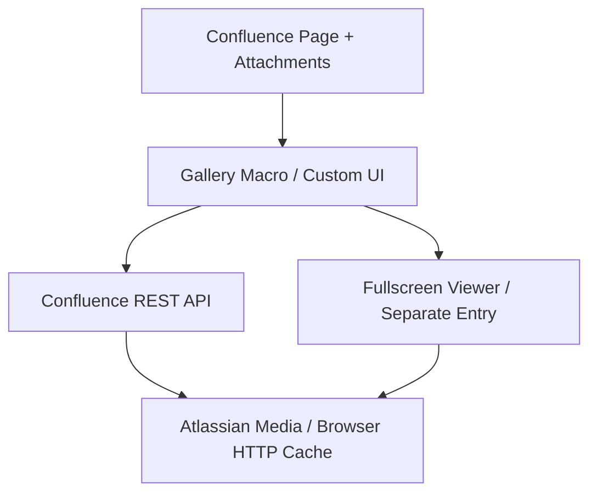
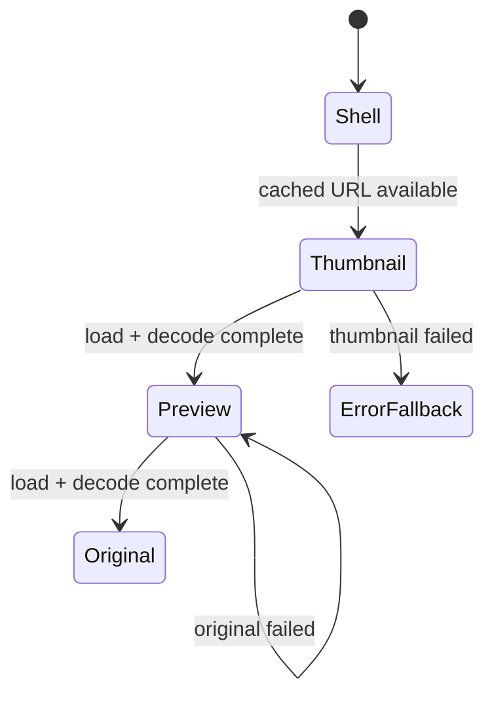

# Confluence Media Gallery V1 機能実装仕様書

| 項目 | 内容 |
|---|---|
| 層 | L2 |
| 対象 | Confluence Cloud向けForge App（Atlassian Marketplace無料掲載、個人開発） |
| 対象バージョン | V1 |
| 名称 | Confluence Media Gallery |

## 0. 結論

V1は、現在のConfluenceページに添付された画像・動画・音声を自動収集し、ArtStation風のサムネイルグリッドと常設のFullscreen Viewerで閲覧する、読み取り専用のForgeマクロとして実装し、Atlassian Marketplaceに無料アプリとして公開する。

### 0.0 前提

| 項目 | 内容 |
|---|---|
| 開発主体 | 個人開発者1名（設計・裁定はユーザー、実装はClaude Code） |
| 配布形態 | Atlassian Marketplaceに無料アプリとして掲載する公開配布 |
| 課金 | 無料アプリ。`app.licensing` は未宣言 |
| 開発期の費用 | Atlassian、Forge、CI、ホスティング、外部サービスの全てで0。0で成立しない要件はユーザー裁定を経て判断する |
| 公開後の費用 | 課金対象capabilityを使用せず、install数に関わらずForge費用0を維持する。課金防止ハーネスは公開後も恒久適用する |
| 統制主体 | 承認・記録はユーザー本人が行い、`docs/operations/cost-surface-register.md` に裁定記録を残す |

本機能の最優先原則は次のとおりとする。

> 操作への視覚応答を最初に返し、利用可能な低解像度表示から段階的に高解像度へ更新する。UIの表示はネットワーク完了から独立させる。

V1で固定する主要判断は以下である。

| 項目 | V1決定 |
|---|---|
| Fullscreen Viewer | 常時有効 |
| 詳細パネル | 初期状態は非表示。Viewer右上の `≡` ボタンで即時切替 |
| パネル配置 | 右端に重ねるフロート。メディア領域の寸法を維持する |
| アニメーション | hover、パネル、画像切替、画面遷移のすべてで即時切替 |
| `≡` ボタン | hover/focus時に背景塗りを即時に濃くする |
| 一覧取得 | 現在ページのAttachmentを自動検出 |
| 初期ロード | Attachmentメタデータと表示領域付近のThumbnail |
| Viewer画像 | Thumbnail → Preview → Originalの順で段階表示 |
| 先読み | hoverでPreview、条件成立後にOriginal。Viewerでは隣接Previewを先読み |
| HTTPキャッシュ | ブラウザとAtlassian CDNに委ねる |
| アプリ内メモリ | LRUと容量上限で管理し、Viewer終了時に解放 |
| 永続キャッシュ | ブラウザHTTP cacheのみ |
| APIポイント最適化 | 操作応答を維持する施策だけを採用する |

### 0.1 恒久方針

次の方針は本アプリの全バージョン、development／staging／productionの全環境、開発・検証・リリース・保守の全期間に適用する。

**許可構成**

| 領域 | 許可 |
|---|---|
| Forge module | Confluence `macro` |
| 実行形態 | Custom UIの静的resource（`gallery`、`viewer`） |
| Bridge API | `requestConfluence`、`Modal`、`events`、`router`、`view` |
| runtime dependency | `@forge/bridge` |
| 通信先 | Confluence siteと、P0-5で確認したAtlassian Media host |
| データ保存 | ブラウザHTTP cacheとdocument内メモリ |
| ログ出力先 | 画面内の診断バッファ（Section 8.4） |
| 課金対象capability | 使用0 |
| Marketplace | 無料掲載。`app.licensing` 未宣言、editions／trialなし |
| 依存ライセンス | permissive licenseのみ（MIT、BSD、Apache-2.0、ISC等）。Forge Termsによりcopyleft（GPL、AGPL、LGPL等）は対象外 |
| 外部サービス | 契約0、API key 0、egress 0 |
| Developer Space | 請求アカウント設定・請求同意済み、支払方法未登録 |
| 新規capability | Section 4.7の許可リストへ明示追加されたもの |

許可構成の外にある機能（Forge Function、Resolver、Trigger、Scheduled Trigger、KVS、Custom Entity Store、SQL、Object Store、Container、Forge LLM、Rovo Agent、外部生成AI、外部S3／CDN／proxy／監視SaaS、Forge Frontend Logs、有料化、EAP／Preview capability）を必要とする要件は、本アプリから切り離し、別案件・別Forgeアプリ・別Developer Spaceとして設計する。許可リストの更新経路はユーザー裁定であり、裁定内容・日付・理由を `cost-surface-register.md` に記録した範囲で更新する。

Forgeへのログ書き込みは0を維持する。Frontend Logsは送信量をアプリ側で制御できず（uncaught exceptionとunhandled rejectionはForge側が自動捕捉する）、反復バグが全テナント分の例外を送信すると無料枠を超え、支払方法未登録でもpre-dunningを経てDeveloper Space内全アプリの停止に至るためである。

Frontend Logsの再評価条件は次の2点をともに満たした時点とし、ユーザー裁定として `cost-surface-register.md` に記録する。

1. Frontend Logsが一般提供となっていること。
2. アプリ側で送信上限、kill switch、またはそれに相当する送信量の制御手段を持てること。

再評価までの本番観測性はSection 8.4の診断レポートで確保する。

公式Usage上のLogs writesの期待値は0である。正値が報告された場合は `RED` として発生源を特定・修正する。

恒久方針はSection 4.7の課金防止ハーネスで機械検査・実測監視・リリース遮断を行う。検査不能、データ欠落、監視値不明は `UNKNOWN` とし、fail closedでdeployを停止する。

## 1. 目的

### 1.1 解決する問題

Confluence標準の画像表示で生じる、クリック後に高解像度データの取得・デコードを待つ体感遅延を軽減する。また、ページ添付メディアを一覧性の高いグリッドで確認し、ページを離れずに連続閲覧できるようにする。

### 1.2 V1の成功条件

1. ページにマクロを置くだけで、対象Attachmentが自動的に一覧化される。
2. 一覧表示で取得するのはメタデータとThumbnailである。
3. サムネイルクリック時、同じevent task内でFullscreen Modalのopen処理を開始する。
4. Viewerは利用可能な最良の画像を直ちに表示し、より高解像度の画像がデコード済みになった時点で差し替える。
5. 前後移動で、表示中メディアの隣接Previewが可能な限りキャッシュから表示される。
6. Viewerを閉じた時点で高解像度のデコード済み画像を解放する。
7. 添付ファイルの版が更新された場合、新版を表示する。
8. Modal起動、Current Preview、前後移動、詳細パネル表示は、APIポイント状況から独立して即時に応答する。

## 2. 適用範囲

### 2.1 V1に含む機能

| 分類 | 機能 |
|---|---|
| データ取得 | 現在ページのAttachment一覧取得、ページネーション追従 |
| メディア分類 | 画像、動画、音声の分類 |
| 一覧 | レスポンシブThumbnail Grid |
| 一覧 | hover時のタイトル即時表示 |
| 一覧 | 動画・音声の種別アイコン表示 |
| 一覧 | 表示領域優先ロード、画面外lazy load |
| Viewer | Forge Fullscreen Modalによる全画面表示 |
| Viewer | 前へ／次へ、画面上ボタン、キーボード左右キー |
| Viewer | `Esc` および閉じるボタンによる終了 |
| Viewer | 画像、動画、音声のブラウザネイティブ再生・表示 |
| Viewer | 画像のThumbnail → Preview → Original段階ロード |
| Viewer | 詳細パネルの即時表示／非表示 |
| 詳細 | タイトル、説明、種別、解像度、時間、ファイルサイズ、更新者、更新日時、ラベル、Originalを開く／Download |
| 性能 | hover先読み、隣接Preview先読み、ロード優先度制御 |
| キャッシュ | バージョン付きキー、LRU、容量制限、ライフサイクル解放 |
| 品質 | 空状態、権限不足、削除済み、非対応形式、通信失敗の表示 |
| 品質 | 詳細パネル内の診断レポート（非永続、sanitize済み、明示操作によるコピー） |

### 2.2 V1以降の扱い

| 項目 | 扱い |
|---|---|
| 画像の独自ズーム／パンUI、1:1表示 | V1.1候補。V1は画面内に収まる `contain` 表示とし、Originalは高DPI表示品質とブラウザ標準操作に使用する |
| タッチスワイプ操作 | V1.1候補 |
| Masonry配置 | V1.1候補 |
| 自動スライドショー | V1.1候補 |
| 全文検索、複合フィルター、ユーザー保存済みビュー | V1.1候補 |
| Attachmentのアップロード、更新、削除、名称変更 | 別案件 |
| タグ編集、コメント編集、リアクション | 別案件 |
| Confluence Data Center対応 | 別案件 |
| 有料化、licensing、editions、trial | 別App ID・別案件（Section 0.1） |
| 外部S3、CloudFront、自前メディアサーバー | 別案件（Section 0.1） |
| 動画トランスコード、音声波形生成、画像形式変換 | 別案件（Section 0.1） |
| オフライン閲覧、永続的な独自画像キャッシュ | 別案件（Section 0.1） |
| fade、slide、scale等の装飾アニメーション | 即時切替で代替（Section 20の5原則） |

## 3. 前提・制約

### 3.1 対象環境

- Confluence Cloud
- Atlassian Forge Custom UI
- Atlassian Marketplace無料掲載による公開配布（Runs on Atlassian適格を維持）
- 顧客siteはFree／Standard／Premium／Enterpriseのいずれでも動作すること。開発・検証は個人のFree環境で行う
- デスクトップ版の最新ChromeおよびEdgeを主対象
- FirefoxおよびSafariは基本動作を確認する。V1の性能保証対象はChrome／Edge
- モバイルではグリッド、Viewer、画面上ボタンを利用可能にする。先読みはデスクトップのpointer環境で行う

### 3.2 メディア形式

V1はブラウザがネイティブにデコード・再生できる形式をViewerで表示する。

| 種別 | V1検証対象 | 非対応時 |
|---|---|---|
| 画像 | JPEG、PNG、WebP、GIF、AVIF、SVG | 汎用タイルとDownload導線 |
| 動画 | MP4/H.264、WebM | 汎用タイルとDownload導線 |
| 音声 | MP3、M4A/AAC、WAV、Ogg | 汎用タイルとDownload導線 |

MIMEが `image/*`、`video/*`、`audio/*` でも、ブラウザが再生できない形式は非対応フォールバックへ移行する。TGA、EXR、PSD、ProRes等は非対応フォールバックの対象である。

### 3.3 権限

API呼び出しはログイン中ユーザーとして行い、そのユーザーが閲覧できるAttachmentを表示する。V1は読み取り専用とし、以下のGranular Scopeを使用する。

- `read:attachment:confluence`
- `read:user:confluence`：詳細パネルで更新者の表示名を解決する場合のみ

Attachment一覧・個別情報・Thumbnail APIは `read:attachment:confluence` を要求する。更新者名は `version.authorId` をユーザー情報へ解決するため、ViewerでCurrent項目が確定しPreview要求を発行した後にバックグラウンド取得する。

## 4. システム構成

### 4.1 採用構成

- Forge `macro` module
- Custom UI
- TypeScript + HTML + CSS
- plain DOM（UIフレームワークなし）
- GalleryとViewerを別Custom UI entry pointとしてビルド
- GalleryからForge Bridge `Modal` を `size: fullscreen` で開く
- GalleryとViewer間の小さなメタデータ同期にはForge Bridge `events` を使用する
- Confluence REST APIはCustom UIから `requestConfluence()` で現在ユーザーとして呼び出す
- DownloadおよびOriginalを開く操作はForge Bridge `router` を使用する（Section 8.3）
- 使用するBridge APIは `requestConfluence`、`Modal`、`events`、`router`、`view` とし、課金防止ハーネスの許可リスト（Section 4.7.2）と一致させる
- 全経路がCustom UIで完結する

ForgeのCustom UI Modalは別resourceまたは複数entry pointを指定でき、`fullscreen` は100vw × 100vhとして提供される。複数entry pointは `<resource-key>/<entry-key>` で指定し、entryのHTMLファイル名は `<entry-key>.html` とする。Galleryの初期バンドルはGalleryロジックのみで構成する。

Modalは `title`／`icon` を未指定とし、ヘッダーなしでiframe全面を使えるかをP0-4で確定する。`closeOnEscape` は `false` とし、EscはSection 7.3の自前handlerで処理する。

### 4.2 Entry point分離

| Entry | 責務 | 初期ロード |
|---|---|---|
| `gallery` | Attachment一覧、グリッド、hover先読み、Modal起動 | ページ表示時 |
| `viewer` | Fullscreen表示、ナビゲーション、詳細、Current／隣接キャッシュ | 最初のクリック時 |

GalleryのFirst Usable GalleryとViewerのJS・CSSロードは独立させる。Galleryが使用可能になった後、ブラウザがアイドル状態のとき、または最初の `pointerenter` 時にViewer静的リソースを温めることを許可する。優先順位は表示中Thumbnailの取得が上である。

Gallery iframeをGalleryセッション中のメタデータキャッシュ所有者とする。ViewerでAttachment詳細または更新者名を取得した場合、許可済みJSONフィールドをForge Bridge `events` でGalleryへ通知し、Galleryは `attachmentId:version` 単位で保持する。次回Modal起動時は利用可能なキャッシュをcontextへ含める。

- event payloadはJSONメタデータのみで構成する。
- Viewer表示、Panel表示、Modal closeはGalleryへの通知と独立に進む。
- Viewer側でも同一document内のキャッシュとin-flight mapを保持する。
- eventが失敗した場合は閲覧を継続し、次回必要時にAPI再取得する。
- Gallery iframeとModal iframe間でForge Bridge `events` が到達することはP0-4で確認し、到達しない場合はGalleryキャッシュ同期を機能から外す。

### 4.3 iframe境界に関する実装規約

GalleryとFullscreen Viewerは別のiframe/documentとなるため、両者の共有はバージョン付きURLとブラウザHTTPキャッシュを介して行う。

hover先読みの目的は、GalleryとViewerで同一のバージョン付きURLを使用し、ブラウザHTTPキャッシュを温めることである。デコード済みデータのdocument間再利用はブラウザ実装依存とし、受け入れ条件はHTTPキャッシュ再利用で判定する。

### 4.4 API

| 用途 | API |
|---|---|
| ページAttachment一覧 | `GET /wiki/api/v2/pages/{pageId}/attachments` |
| Attachment詳細 | `GET /wiki/api/v2/attachments/{attachmentId}` |
| Thumbnail／Preview | `GET /wiki/api/v2/attachments/{attachmentId}/thumbnail/download` |
| Original download URL | `GET /wiki/rest/api/content/{pageId}/child/attachment/{attachmentId}/download`（302）を第一候補とし、一覧レスポンスの `downloadLink` とともにP0-2で検証して正本を確定する |
| 更新者表示名 | `POST /wiki/api/v2/users-bulk` |

Thumbnail endpointは `version`、`width`、`height` を受け取り、302で実データURLへリダイレクトする。Original download endpointも302を返し、`version` を指定できる。実際のメディアURLを ``、`<video>`、`<audio>` から直接ロードできるかは、Section 14のPoCゲートで確定する。

### 4.5 Confluence Cloud APIポイント方針

Confluence Cloud APIポイントはConfluence REST／GraphQL APIの時間単位レート制限容量であり、Forge利用料金とは別系統である。既定Tier 1（Global Pool）は、同一アプリの全テナントを合算して65,000ポイント／時である。本アプリ以外のForge／Connect／OAuthアプリはそれぞれ独立した枠を使用する。

公開後はこのGlobal Poolが本アプリの全install・全テナントの合算になる。主題はテナント数の増加に対する上限管理である。Per-Tenant Pool（Tier 2）の適用可否と上位Tierの申請条件はSection 14 P0-6で公式資料から確定し、`RateLimit-*`／`Retry-After` を受けた場合の縮退動作（Section 11.1）を必須実装とする。

本アプリでは、操作応答とメディア表示速度をAPIポイント節約より優先する。採否の優先順位は以下で固定する。

1. 操作への視覚応答とCurrentメディアの表示速度
2. データの正確性と版整合性
3. APIポイントおよびリクエスト数の削減

ポイント節約策は、次のすべてで計測値が同等に保たれる場合に採用する。

- Thumbnail click → `Modal.open()` 呼び出し時間
- Viewer shell → Current Thumbnail／Preview表示時間
- 前後移動 → 次メディア表示時間
- `≡` 操作 → 詳細パネル枠と一覧由来フィールドの表示時間

#### 4.5.1 採用する節約策

| 施策 | 実装規約 | 応答速度への条件 |
|---|---|---|
| 一覧レスポンス再利用 | `title`、`comment`、`mediaType`、`fileSize`、`version`、`authorId`、`downloadLink` をViewerへ引き継ぎ、同じ値は一覧レスポンスから表示する | Modal起動前の処理はsnapshot生成のみ |
| セッション内メタデータキャッシュ | `attachmentId:version` 単位で詳細を保持し、戻る操作、Panel再表示、Viewer再openで再利用する | Bridge eventの完了とUI処理は独立 |
| in-flight重複排除 | 同じAPIキーの要求が進行中なら同じPromiseを共有する | 先行要求の優先度を維持する |
| 更新者キャッシュ | `authorId → displayName` をGalleryセッション中に共有する | 未取得のCurrent更新者は直ちに要求する |
| users-bulk集約 | 同一event loop内で判明している未解決authorIdを1要求へまとめる | 集約はevent loop単位のみ |
| URL統一 | GalleryとViewerで同じversion付きThumbnail／Preview URLを使用し、ブラウザHTTP cacheの再利用を最大化する | 解像度は表示必要量に基づいて選ぶ |
| queue整理 | pointerが離れた時点で未開始の低優先preloadを削除する | Current、隣接Preview、開始済みで完了間近の要求は維持 |
| 取得契機の限定 | API取得の契機は初期取得、明示Retry、必要な版確認とする | 表示中の更新検出とユーザー操作は即時 |

Attachment一覧のページサイズは、Phase 0で「最初のタイル表示」と「全件取得完了」の両方を計測し、First Usable Galleryが最速になる値を採用する。続きのページは1ページ目の描画と並行して取得する。

#### 4.5.2 節約策の採否境界

以下の条件を満たす施策のみを、本アプリの全バージョンで節約策として採用する。

- click、`pointerenter`、前後移動、詳細ボタンの各handlerに含まれる処理は、同期処理とrequest発行のみである。
- Modal起動とCurrent Preview要求は、APIポイント残量から独立して発行する。
- hover Preview先読みとViewer隣接Preview先読みは、Section 11.1の縮退段階以外では常時有効である。
- 詳細取得はCurrent Preview要求の直後に開始する（Section 4.5.3）。
- Currentメディア要求は、一覧再検証、Attachment詳細、更新者、ラベル取得より先に発行する。
- Thumbnail／Previewの解像度は表示必要量から決める。
- API呼び出しの集約は同一event loop内に限る。
- キャッシュはCustom UI内のセッションキャッシュとブラウザHTTP cacheで構成する。
- Attachment versionは表示のたびに一覧レスポンスまたはAPIで確認する。

#### 4.5.3 Current詳細の取得タイミング

ViewerでCurrent項目が確定したら、Current Preview要求を発行した直後に、未キャッシュのAttachment詳細と更新者情報をバックグラウンド取得する。

- 一覧レスポンスにあるフィールドはAPI完了から独立して表示する。
- ラベル等の不足フィールドを `include-labels=true` で取得する。
- 先読み対象はCurrent項目のみとする。
- 前後移動で過去に表示した項目へ戻る場合はセッションキャッシュを使う。
- 詳細APIが未完了でもパネル枠と既取得フィールドは同じframeで表示する。
- Current変更時、旧項目の未開始詳細要求はqueueから削除する。開始済み要求は安全にabortできる場合に中止し、それ以外は完了後にキャッシュする。
- 新しいCurrentの詳細要求を、旧項目の未開始queueより前へ挿入する。

#### 4.5.4 容量計画上の基準値

50 Attachmentのページで、20人／週が各1回利用し、各セッションで約30件をViewer表示する標準ケースは、以下を基準値とする。

| 指標 | 基準値 |
|---|---|
| 1セッション | 代表値 約258ポイント |
| 1セッション想定範囲 | 約194〜320ポイント |
| 20セッション／週 | 代表値 約5,160ポイント |
| 20セッションが同一UTC時に集中 | 65,000ポイント／時の約7.9% |

この基準値はP0-6で、公式コスト式（基本1ポイント＋オブジェクト加点。コア1、ユーザー・権限2）による実測値で改訂する。支配項はメディア取得リクエスト（Thumbnail／Preview／Original）になる見込みであり、Thumbnail endpointの302、ネストされたlabel、Atlassian Media/CDNへの直接取得が何ポイントとして観測されるかを実測で確定する。評価はUTC毎時の最大集中量で行う。

APIポイントの上限はAtlassianの審査による上位Tier（Per-Tenant Pool）の割り当てで増加する。本アプリの対策は、Section 4.5.1の節約策と、Section 11.1の段階的縮退の2つで構成する。App IDは1つで運用する。

公開配布では、上記の1テナント値に同時利用テナント数を掛けた値がGlobal Pool（65,000ポイント／時）に対する消費になる。基準値では「同一UTC時に20セッションを行うテナント」が同時に約12テナント存在した時点で飽和する。飽和時の挙動はSection 11.1の縮退とし、Marketplace掲載後はDeveloper ConsoleのAPI metricsで毎週ポイント消費を確認する。

### 4.6 manifest方針

- macroはblock layoutとする。
- Gallery用resourceとViewer用resourceを宣言する。
- ViewerはModalの別resource／entry pointとして指定する。
- egress宣言は0とする。Atlassian app APIのリダイレクト先（`api.media.atlassian.com` 等）は内部通信として扱われる。P0-5で宣言なしにメディアがロードできない事実が確認された場合に限り最小hostを追加し、その追加がRuns on Atlassian適格性に影響する場合はユーザー裁定を経る。
- `app.licensing` は未宣言とする。
- Runs on Atlassian適格性をForge CLIの適格性確認で毎リリース確認する。
- hostは個別のAtlassian hostのみ許可する。
- 権限追加時は `forge lint` とインストールupgradeを実施する。

### 4.7 課金防止ハーネス

課金防止ハーネスは、本アプリの全バージョン・全環境へ恒久適用する。目的は、課金対象capabilityの利用を設計・コード・build・実環境の四層で検出し、各課金対象メトリクスのアプリ内許容値を0に維持することである。

支払方法未登録は補助統制であり、本体はハーネスによる使用量0の維持である。

#### 4.7.1 ゼロ使用量不変条件

Forge料金表にある課金対象capabilityを、次の内部基準で監視する。内部許容値は公式無料枠から独立して0とする。

| 課金対象メトリクス | 本アプリの許容値 | 違反判定 |
|---|---|---|
| Forge Functions duration | 0 GB-seconds | 表示値が0を超えた時点 |
| KVS reads | 0 GB | 表示値が0を超えた時点 |
| KVS writes | 0 GB | 表示値が0を超えた時点 |
| Logs writes | 0 GB | 表示値が0を超えた時点 |
| SQL compute duration | 0 hour | 表示値が0を超えた時点 |
| SQL compute requests | 0 requests | 表示値が0を超えた時点 |
| SQL data stored | 0 GB-hours | 表示値が0を超えた時点 |
| Object Store requests | 0 requests | 表示値が0を超えた時点 |
| Forge LLM input／output | 0 credits | 正値を検出した時点 |
| Containers compute／memory | 0 | 正値を検出した時点 |
| Usage and costsの算定費用 | USD 0.00 | USD 0.00を超えた時点 |

ハーネスはDeveloper Spaceに加え、次の請求面を対象とする。既存の無料契約は、そのプラン、ユーザー数、容量、オプションを本アプリのために維持する場合にbaselineとして扱う。

| 請求面 | 恒久基準 | 検出方法 |
|---|---|---|
| Atlassian developer site（開発用） | 無料のcloud developer site（Confluence 5ユーザー） | Atlassian Administrationのplan表示をユーザーが確認 |
| 個人Confluence Free site（検証・自己利用） | Freeプラン（10ユーザー・2 GB）、trialなし | Atlassian Administrationのplan、trial表示、storageをユーザーが確認 |
| Developer Space | 請求アカウント設定と請求同意のみ。支払方法未登録。Usage 0、算定費用USD 0.00 | Developer Console Settings／Billing Consoleで確認 |
| Source hosting／CI/CD | GitHub Freeの無料枠内。standard runner、無料分数、無料storage | 請求設定と利用量をユーザーが確認し、runner／upload設定を静的検出 |
| 外部API／SaaS／CDN／storage／AI | 契約、API key、egressとも0 | dependency、source、build、通信origin、secret名を静的検出 |
| Marketplace | 無料掲載。licensing、editions、trial、有料plan、広告・プロモーション費用0 | manifest、Marketplace listing設定、Developer Consoleの配布設定を確認 |
| ホスティング（privacy policy、support URL） | GitHub Pages等の無料ホスティング、無料ドメイン | listingのURLとホスティング設定をユーザーが確認 |

公式料金表へ課金対象が追加された場合、ハーネスで明示的に0判定できるまで状態を `UNKNOWN` とし、production deployを停止する。料金単価や無料枠の変更にかかわらず、内部許容値は0を維持する。

Confluence Cloud APIポイントはForge課金メトリクスとは別系統であり、Section 4.5の性能優先方針とSection 11.1の縮退で扱う。

#### 4.7.2 リポジトリ静的ゲート

リポジトリには以下を正本として置き、`npm run verify:cost` で一括検査する。

| 成果物 | 責務 |
|---|---|
| `config/forge-cost-policy.json` | 許可するmanifest構造、scope、Atlassian Media host、runtime dependency、Bridge APIを正の許可リストで定義 |
| `scripts/verify-forge-cost-policy.mjs` | manifest、package、lockfile、source、build出力を解析し、機械可読reportを生成 |
| `tests/cost-guard/negative-fixtures/` | 検出対象を1項目ずつ混入させ、必ず検出できることを自己試験 |
| `test-results/cost-guard/<commit-sha>.json` | commit SHA、policy version、manifest hash、lockfile hash、各検査結果を保存するrelease証跡 |
| `docs/operations/cost-surface-register.md` | Forge、Confluence、CI／repository、外部サービス、Marketplaceの請求面、責任者、baseline、最終確認日、有効期限、裁定記録IDを記録 |

静的ゲートは許可リスト方式で動作し、次の検出対象を拒否する。拒否対象の列挙は機械検査ルールとして必要である。

1. `manifest.yml` の構造解析：許可済みmacro、Gallery／Viewer resource、最小scope、承認済みAtlassian Media host以外のkey・値。
2. manifestの機能宣言：`function`、Resolverを必要とするmodule、Trigger、Scheduled Trigger、consumer、webtrigger、queue、storage、SQL、Object Store、Container、Rovo、LLM、`remotes`、external authentication provider、licensing。
3. runtime dependency：`@forge/bridge` 以外の `package.json`／`package-lock.json` runtime dependency差分。
4. source ASTとbuild出力：`invoke`、`invokeRemote`、Forge storage／SQL／LLM API、`fetch`、`XMLHttpRequest`、`WebSocket`、`EventSource`、`sendBeacon`、外部SDK import。Confluence通信は共通adapter内の `requestConfluence()` のみを許可する。
5. console出力：`console.error`、productionへ残る `console.log`、uncaught rejectionを意図的に発生させるコード、反復エラーループ。development専用出力がproduction buildから除去されていることをbuild出力で確認する。Section 8.4のglobal error handlerが登録されていること、およびそのhandlerが `console.error` 呼び出しと再throwを含まないことを検査する。
6. URL literalとCSP差分：`https` 以外、wildcard、非Atlassian origin、未承認origin。
7. CI／repository設定：未承認hosted runner、従量課金option、artifact／log／LFS／package upload、長期retention、外部build service。CI providerの請求planを静的に確認できない場合は、`cost-surface-register.md` の有効な裁定記録IDがある場合に限り `GREEN` とし、それ以外は `UNKNOWN` とする。
8. 保護対象：guard本体、policy、CI workflow、`manifest.yml`、`package.json`、`package-lock.json`、`cost-surface-register.md` の変更はCODEOWNERS相当の保護（自己レビューの明示的承認とbranch protection）を要求する。
9. 検査完全性：1検査でも実行不能なら終了codeを非0とする。検査例外、warning-only、`continue-on-error`、空の検査結果はすべて非0扱いとする。
10. license：`manifest.yml` に `app.licensing` が存在しないこと、production bundleとruntime dependencyがpermissive licenseのみで構成されることをlockfileのlicenseフィールドとSPDX識別子から検査する。copyleft（GPL、AGPL、LGPL、MPL-2.0以外のfile-level copyleft等）およびlicense不明のpackageは拒否する。

負例fixtureはCIで毎回実行し、各検出カテゴリが期待したrule IDで失敗することを確認する。正常系と負例の両方が通ることを合格条件とする。

#### 4.7.3 実環境の定量監視

静的ゲート通過後も、Atlassian Developer Consoleの `Usage and costs` を実測の正本とする。対象はdevelopment、staging、production、custom development environmentを含む全環境である。

| タイミング | 必須証跡 |
|---|---|
| App登録直後・初回deploy前 | 全課金対象メトリクス0、または対象期間の利用実績なしを示す正常な空状態、算定費用USD 0.00、支払方法未登録のbaseline |
| 各staging候補のテスト後 | 次回の日次更新後の全メトリクス値、前回との差分、環境別内訳 |
| production deploy前 | 48時間以内のusage snapshot、31日以内のcost-surface register、`GREEN` のcost-guard report、支払方法未登録確認 |
| production初回7日間 | 日次更新後に毎日確認 |
| 安定運用後 | 毎週、月末、翌月最初の請求確認日に確認 |
| 月次 | Developer Site／本番Confluence／CI・repository／外部契約／Marketplaceの差分と増分費用0を確認し、cost-surface registerを更新 |
| Forge CLI／manifest schema／料金表更新時 | 新capabilityの有無とpolicy対応状況を再監査 |

Developer Consoleの使用量データは日次（12:00 UTC）更新され、参照できるのは直近60日分である。月次snapshotは対象月終了から60日以内に取得する。即時検知は静的ゲート、Usage Alert、ブラウザNetwork検査で補完する。App resource usage APIを使う自動取得は、ユーザーが認証情報管理を承認した場合にread-onlyで使用する。API取得失敗時は `UNKNOWN` とし、Developer Consoleの手動確認へ切り替える。

各snapshotには、取得UTC、対象期間、App ID、commit SHA、環境、各usage値とunit、前回差分、cost、確認者を記録する。記録する値は数値・unit・時刻・識別子に限る。

Developer Consoleが対象期間の「利用実績なし」を正常に示す空状態は、表示値0と同義に扱う。権限不足、画面／APIの読込失敗、日次更新前、対象期間・environment未選択による空表示は `UNKNOWN` である。

cost-surface registerの有効期間は最終確認から31日とし、請求plan、workflow、dependency、secret、network、配布設定の変更時は即時再確認する。

#### 4.7.4 判定状態と遮断動作

| 状態 | 条件 | 動作 |
|---|---|---|
| `GREEN` | 静的ゲート合格、全usage 0、Forge cost USD 0.00、全請求面の増分費用0、支払方法未登録、48時間以内のsnapshotと有効なcost-surface registerあり | staging／production promotion可能 |
| `RED` | いずれかのusageまたは費用が正値、支払方法登録、有料plan／従量設定、検出対象、Usage Alertのいずれかを検出 | deploy・install・upgrade・Sharing変更を即時凍結 |
| `RECOVERING` | 原因除去と静的ゲート合格後、現時点の増分0を確認済みだが、当月累積usage／費用が正値、または最終invoiceが未確定 | 凍結を継続 |
| `UNKNOWN` | active trial／plan移行待ち、dashboard未更新、snapshot期限切れ、cost-surface registerが31日超または請求面証跡不備、API／検査失敗、新課金項目を未判定 | `RED` と同様に凍結 |

公開アプリでは、Developer Spaceの請求失敗が強制措置に至ると全顧客のinstallが停止するため、`RED` は全顧客への障害予告として扱う。`RED` 時は、対象環境・site・resourceをDeveloper Consoleで切り分け、最後の `GREEN` commitとの差分を確認する。原因buildの利用を停止し、最後の `GREEN` buildへ戻すか対象siteから一時的にアンインストールする。復旧手段は原因除去のみとする。

月内累積値は原因除去後も維持される。原因修正版の静的ゲート合格、現時点の全請求面の増分0、Forge算定費用USD 0.00、日次更新をまたぐ2回連続snapshotで対象メトリクスの増分0を満たした時点で `RECOVERING` とする。次の月次請求期間で全usageの絶対値0、全請求面の増分費用0、未解決invoice／pre-dunningなしを確認した時点で、ユーザーが `GREEN` 復帰を記録する。Usage Alertメールは50%到達で届くため、内部の正値検出を主検知、公式Alertを最終防衛線とする。AlertはアプリがDeveloper Spaceへ割り当てられ同意手続きが完了していることが前提で、app contributorとbilling adminに届く。ユーザーをbilling adminへ登録する。

## 5. データ仕様

### 5.1 MediaItem

アプリ内ではAttachmentを次の論理データとして扱う。

| フィールド | 必須 | 取得元／算出方法 |
|---|---|---|
| `attachmentId` | 必須 | Attachment `id` |
| `pageId` | 必須 | Macro context／Attachment `pageId` |
| `version` | 必須 | `version.number` |
| `title` | 必須 | `title`。空の場合はファイル名相当のfallback |
| `mediaType` | 必須 | `mediaType` |
| `kind` | 必須 | `image` / `video` / `audio` / `unsupported` |
| `fileSize` | 任意 | `fileSize` |
| `createdAt` | 任意 | `createdAt` |
| `updatedAt` | 任意 | `version.createdAt` |
| `authorId` | 任意 | `version.authorId` |
| `comment` | 任意 | `comment`。詳細説明として使用 |
| `labels` | 任意 | 個別詳細の `labels.results` |
| `downloadLink` | 必須 | P0-2で確定した正本（v1 download endpointのURL、または一覧レスポンスの `downloadLink`／`_links.download`）。UIでの使用はP0-2確定後 |
| `width` / `height` | 任意 | 画像・動画elementのintrinsic metadata |
| `duration` | 任意 | 動画・音声の `loadedmetadata` |

値が得られた任意項目のみを行として表示する。

### 5.2 キャッシュキー

メディアリソースの論理キーは以下とする。

`attachmentId : version : variant : sizeBucket`

| 要素 | 値例 |
|---|---|
| `attachmentId` | `123456` |
| `version` | `5` |
| `variant` | `thumbnail` / `preview` / `original` |
| `sizeBucket` | `320` / `640` / `1280` / `1920` / `2560` / `3840` / `source` |

URLは版ごとに一意にする。Thumbnailとdownload endpointではAPIがサポートする `version` を指定する。リダイレクト後URLを利用する場合、そのURLが版固有であることをPoCで検証する。

## 6. Gallery機能仕様

### 6.1 初期化

1. Galleryの静的HTMLと背景を描画する。
2. Forge contextから現在の `pageId` を取得する。
3. Attachment一覧の1ページ目を要求する。
4. 1ページ目の結果で対象メディアを分類し、直ちにグリッド描画を開始する。
5. 続きのページがある場合は順次取得し、既存グリッドを維持したまま追加する。
6. 全件取得完了後に順序を確定する。再配置は一度とし、可能ならAPIのsortを利用する。

V1の既定順序は更新日時の降順、同一日時では `attachmentId` の昇順とする。並び順はV1固定とする。

一覧取得結果はGalleryセッションの正本とし、Viewer open／closeや前後移動ではセッションの正本を使う。同じ一覧要求の再送契機は、初回失敗後の明示Retryと版不整合の検出とする。

### 6.2 グリッド

- CSS Gridで実装する。
- 既定タイル比率は4:3とし、中央基準の `object-fit: cover` を使用する。
- 列数はコンテナ幅に追従する。
- タイル最小幅の初期値は220 CSS pxとし、一箇所のdesign tokenで変更可能にする。
- Thumbnailの縦横比枠を画像取得前から確保する。
- タイル全体をクリック／Enter／Spaceで開ける操作対象にする。
- 一覧表示時の取得対象はメタデータとThumbnailである。
- 200件を超える場合、タイルDOMは複数frameに分けて追加する。
- V1の動作検証上限は1ページ500件とする。500件を超える場合も取得を継続し、性能保証対象は500件までとする。

### 6.3 Thumbnailロード

| 対象 | 方針 |
|---|---|
| 初回viewport内 | eager、優先度high |
| viewport直近1画面分 | eagerまたは早期lazy、優先度auto |
| それ以外 | `loading=lazy` + IntersectionObserver、優先度low |

要求サイズはタイルの表示幅 × `devicePixelRatio` 以上となる最小size bucketを選ぶ。上限は640 pxとする。画面密度の変化・リサイズ時に、既に十分なサイズを取得済みなら取得済み画像を維持する。

### 6.4 hoverタイトル

- タイトル要素は初回DOM生成時から存在させる。
- pointer hover時に、タイル下端の半透明背景上に表示する。
- 表示切替は即時とする。
- 表示切替はCSS `:hover`／`:focus-visible` で行う。
- 長いタイトルは1行ellipsis。完全なタイトルはアクセシブル名として保持する。

### 6.5 hover／pointer先読み

デスクトップでは `pointerenter` 時に対象画像のPreview要求を直ちにキューへ入れる。タイトル表示と先読み処理は独立させる。

Originalのhover先読みは、以下をすべて満たす場合に行う。

1. 同じタイル上にpointerが残っている。
2. Previewの取得とdecodeが完了している。
3. Original先読みlaneが空いている。
4. `Save-Data` が無効である。
5. Network Information APIが利用可能な場合、`3g` 以上である。

`pointerleave` 時は、未開始の要求をキューから削除する。開始済みのnative image requestは安全に中止できる場合にbest effortで中止する。

タッチ環境では `pointerdown` 時にPreviewをキューへ入れ、clickで直ちにModalを開く。

## 7. Fullscreen Viewer機能仕様

### 7.1 起動

サムネイルclick handlerは同じevent task内でModalのopenを開始する。click handlerに含まれる処理はsnapshot生成と `Modal.open()` 呼び出しである。

GalleryからModal contextへ、選択indexと並び順を再現できるcompact snapshotを渡す。snapshotには `pageId`、`attachmentId`、`version`、`title`、`kind`、Thumbnail参照、Original参照を含める。snapshotはJSONメタデータで構成する。

### 7.2 レイアウト

- 背景は暗色。
- メディアは利用可能領域の中央に `contain` 表示する。
- 詳細切替の `≡` ボタンを右上に配置する。
- 閉じるボタンは、P0-4でForge fullscreen Modalにヘッダーが表示されないと確認できた場合に左上へ自前配置する。ヘッダーが表示される場合はForgeの閉じるボタンを正とする。
- 前へ／次へボタンを左右端中央へ配置する。
- 操作ボタンのhit areaは最低44 × 44 CSS pxとする。
- ボタンおよびパネルの状態変化は即時とする。
- コントロールはメディアの縁に重ね、メディアの中央鑑賞領域を確保する。

### 7.3 ナビゲーション

| 入力 | 動作 |
|---|---|
| 左ボタン／`ArrowLeft` | 前のメディア |
| 右ボタン／`ArrowRight` | 次のメディア |
| `Esc`／閉じるボタン | Viewerを閉じる |
| `≡` click、または `≡` にfocusがある状態のEnter／Space | 詳細パネルを切り替える |

- 先頭で「前へ」、末尾で「次へ」は無効化する。
- form controlや動画・音声のnative controlにfocusがあるときは、そのcontrolがキー入力を処理する。
- Enter／Spaceはfocus中のボタンだけを作動させる。
- EscはModalの `closeOnEscape: false` を前提に自前handlerで処理し、`view.close()` でModalを閉じる。
- ナビゲーション時は現在の動画・音声をpauseし、media source参照を解放する。
- 新しい画像の表示状態は毎回 `fit` に戻す。

### 7.4 画像表示

表示シーケンスは以下とする。

- Modalの起動は画像要求より先に行う。
- ViewerはGalleryと同じThumbnail URLを最初に設定し、HTTPキャッシュ再利用を狙う。
- PreviewとOriginalは別のpreload elementで `load` と `decode()` の完了を待つ。
- 差し替えは次のanimation frameで一度だけ行う。
- 差し替えは即時とする。
- Original失敗時はPreviewを維持する。
- Preview失敗時はThumbnailを維持する。
- すべて失敗した場合はエラーfallbackとRetry、Originalを開く／Downloadを表示する。

### 7.5 Previewサイズ

PreviewはViewer内の表示領域と `devicePixelRatio` から必要画素数を算出し、次のbucketから最小の十分な値を選ぶ。

`1280 / 1920 / 2560 / 3840 px`

- 既定上限は3840 px。
- Originalの実寸が判明しており必要幅より小さい場合はOriginalを直接候補にできる。
- Panelの開閉はメディア領域の寸法を維持するため、Previewは開閉前のものを使い続ける。

### 7.6 動画

- 一覧ではThumbnail／posterと再生アイコンを表示する。
- Viewerで初めてvideo elementを生成する。
- `autoplay` は無効。
- 初期値は `preload=metadata`。
- 本体転送はユーザーの再生操作で進める。
- native controlsを使用する。
- Original URLがHTTP Rangeに対応し、seek時に206 Partial Contentを返すことをV1動画機能のリリースゲートとする。
- Viewer移動／終了時はpauseし、sourceを解除して `load()` し、bufferをブラウザが解放できる状態にする。

### 7.7 音声

- 一覧では汎用artworkと音符アイコンを表示する。
- Viewerではnative audio controlsを使用する。
- `autoplay` は無効、初期値は `preload=metadata`。
- 表示要素はnative controlsのみで構成する。

## 8. 詳細パネル仕様

### 8.1 表示動作

- 初期状態は閉じる。
- `≡` ボタン押下で同じframe内に表示／非表示を切り替える。
- パネルは右端へのoverlayであり、メディアの寸法と配置を維持する。
- 切替は即時とする。
- Viewer内で前後移動しても開閉状態を維持する。
- Viewerを閉じて再度開いた場合は閉じた状態へ戻す。
- ViewerでCurrent項目が確定し、Current Preview要求を発行した直後に、未キャッシュの詳細取得を開始する。
- パネル枠と既取得フィールドは直ちに表示し、遅延フィールドは行単位のskeletonまたは「取得中」で置き換える。
- 同じ `attachmentId:version` の詳細要求が進行中または取得済みなら、そのPromiseまたはキャッシュを使う。

### 8.2 `≡` ボタン状態

| 状態 | 背景 |
|---|---|
| 通常 | `rgba(255,255,255,0.08)` 相当 |
| hover／focus-visible | `rgba(255,255,255,0.18)` 相当 |

- 色変更は即時とする。
- 開閉状態は `aria-expanded=true/false` で公開する。
- アクセシブル名は「詳細情報を表示」／「詳細情報を非表示」とする。
- `≡` の形状は固定とする。

### 8.3 表示項目

| 項目 | 情報源 | 取得タイミング |
|---|---|---|
| タイトル | Attachment `title` | 一覧取得時 |
| 説明 | Attachment `comment` | 一覧または詳細取得時 |
| 種別 | `mediaType` | 一覧取得時 |
| 解像度 | image/video intrinsic metadata | メディアmetadata取得時 |
| 長さ | video/audio `duration` | `loadedmetadata` 時 |
| ファイルサイズ | `fileSize` | 一覧取得時 |
| 更新者 | `version.authorId` → users-bulk | Viewer Current移動直後。Preview要求発行後 |
| 更新日時 | `version.createdAt` | 一覧取得時 |
| ラベル | `include-labels=true` の個別取得 | Viewer Current移動直後。Preview要求発行後 |
| Original／Download | download URI | パネル表示時 |

ユーザー情報はGalleryセッション内で `authorId → displayName` をキャッシュする。プロフィール閲覧制限等で名前を取得できない場合は更新者行を非表示にする。

DownloadまたはOriginalを開く操作はForge Bridgeのrouter機能を使用する。

### 8.4 診断レポート

本アプリの本番triageは、利用者から提供される診断レポートで行う。詳細パネルの末尾に「診断情報をコピー」操作を置き、以下を満たす。

**収集**

- Gallery／Viewerそれぞれのdocument内に、非永続の診断バッファ（ring buffer）を持つ。上限は直近50件。
- global error handlerとして `window.onerror`（または `error` event）と `unhandledrejection` を登録し、捕捉した内容を診断バッファへ記録する。handlerの処理は診断バッファへの記録のみで構成する。
- Section 11.1の縮退状態遷移、probe発行、429受領、`Retry-After` 値を時刻付きで記録する。
- ブラウザUA、viewport、`devicePixelRatio`、アプリversion、environment、縮退状態、キャッシュ件数を記録する。
- 記録先はメモリ内のみとし、Viewer close／Macro unloadで破棄する。

**sanitize**

診断レポートに含める情報は次のとおりに限る。

- Attachmentの参照は `attachmentId` と `version`。
- エラーメッセージとstack trace。除外項目が混入し得るメッセージ文字列は定型化する。
- 上記と環境情報（UA、viewport、DPR、version、environment、縮退状態、キャッシュ件数）。

除外項目：Attachment URL、signed URL、redirect先URL、account ID、タイトル、コメント、ラベル、ファイル名、pageId、siteのhostname。

**出力**

- ユーザーが「診断情報をコピー」を明示操作したときに、sanitize済みのtextをclipboardへ書き込む。
- 出力先はsupport導線（GitHub Issuesまたはメール）へユーザーが自分で貼り付けることを前提とする。
- クリップボード書き込みが利用できない環境では、選択可能なtextareaで表示する。

**将来のFrontend Logs対応**

Section 0.1の再評価条件が満たされた場合、診断バッファの記録経路を送信上限付きでFrontend Logsへ切り替えられるよう、記録APIを一箇所のadapterに集約する。切替はユーザー裁定と許可リスト更新を経て、V1.1以降で実装する。

## 9. ロード優先度・同時実行数

### 9.1 優先順位

| 優先度 | 対象 |
|---|---|
| 1 | Viewer Current Preview |
| 2 | Gallery viewport内Thumbnail |
| 3 | Viewer Current Original |
| 4 | Viewer Previous／Next Preview |
| 5 | hover中Gallery Preview |
| 6 | Gallery viewport近傍Thumbnail |
| 7 | Viewer Previous／Next Originalの条件付き先読み |
| 8 | 画面外Thumbnail、その他 |

低優先タスクの新規開始はCurrent Previewの表示後とする。

CurrentのAttachment詳細／更新者要求は、Current Previewの要求開始後に別API laneで開始する。Currentメディア表示はその完了から独立し、低優先メディア先読みより先に扱う。

レート制限の縮退段階（Section 11.1）では、優先度の低い側から打ち切る。`Degraded` では優先度1〜4のうちCurrent Previewとviewport内Thumbnailを維持し、優先度5以降を停止する。`Blocked` では新規REST要求を停止する。いずれの段階でも、優先度1の要求と `Modal.open()` は即時発行する。

### 9.2 lane上限

| lane | 最大同時数 |
|---|---|
| Thumbnail | ブラウザに委譲。eager対象をviewport周辺へ限定 |
| Preview preload | 2 |
| Original image preload | 1 |
| Attachment detail API | 2。新Currentの要求は直前Currentの完了／cancelと独立に開始する |
| User lookup API | 1 |

### 9.3 隣接先読み

Currentがindex `n` の場合、Viewerは以下を行う。

- Preview：`n ± 1` を優先し、その後 `n ± 2`、最大保持範囲は `n ± 3`
- Original：Currentを最優先。Current完了後、Viewer上で1秒以上操作がない、通信条件が良好、容量上限内の場合に `n ± 1` を1件ずつ先読みする
- 動画・音声：本体とmetadataの取得契機はCurrentへの移動とする

## 10. キャッシュ仕様

### 10.1 キャッシュ層

| 層 | 管理主体 | V1方針 |
|---|---|---|
| HTTP／disk cache | ブラウザ、Atlassian CDN | 利用する。管理はブラウザとCDNに委ねる |
| Gallery DOM／preload参照 | Gallery iframe | Thumbnail中心。hover preloadは小さなLRU |
| Viewer decoded image参照 | Viewer iframe | Preview／OriginalをLRU管理 |
| メタデータ | アプリ | Galleryセッション中のみ保持 |

HTTP cacheのTTL、再検証、evictionはAtlassianのレスポンスヘッダーとブラウザに委ねる。アプリはHTTP cacheをbest effortの高速化手段として扱う。

### 10.2 保持範囲と容量

| 種類 | 保持ルール | soft limit |
|---|---|---|
| Thumbnail | 表示中Galleryとviewport近傍。DOM lifecycleに従う | 独自容量計算なし |
| Gallery hover Preview | 直近候補をLRU保持 | 64 MB |
| Viewer Preview | Currentをpin、優先範囲Current ± 3 | 256 MB |
| Viewer Original | Currentをpin、最大Current ± 1 | 512 MB |
| Attachment詳細 | Galleryセッション中、version単位 | 件数上限500 |
| 更新者名 | Galleryセッション中、authorId単位 | 件数上限100 |

画像のaccounting weightは `naturalWidth × naturalHeight × 4 bytes` を基準にする。これはLRU eviction用の保守的な比較値である。

Current画像が単体でsoft limitを超える場合は、一時的な超過を許容してCurrentを維持し、他の同種キャッシュをすべてevictする。

### 10.3 eviction順序

容量超過時は次の順で解放する。

1. Currentから最も遠いOriginal
2. 最終使用時刻が古いOriginal
3. Currentから最も遠いPreview
4. 最終使用時刻が古いPreview

Current表示に使用中のリソースはpinし、ナビゲーション完了後にunpinする。

### 10.4 ライフサイクル

| イベント | 処理 |
|---|---|
| `pointerleave` | 未開始preloadを削除。開始済みはbest effort cancelまたは完了後参照解放 |
| Viewer内の移動 | 旧Currentをunpinし、範囲外をLRU候補化 |
| Viewer close | ViewerのPreview／Original／media element参照、queue、timerを全解放 |
| Macro unload／ページ遷移 | Gallery DOM、preloader、metadata、queue、event listenerを全解放 |
| Attachment version変更 | 旧versionの全アプリ内entryを即時無効化 |
| Blob URL使用時 | 対応elementから切り離した後に `URL.revokeObjectURL()` |

Blob URLの用途はThumbnail fallbackに限り、対応する参照解放時に必ずrevokeする。

### 10.5 版更新

- API再取得で同一 `attachmentId` の `version.number` が変化したら旧版をstaleとする。
- 旧版のpreload queueを削除する。
- Viewerで該当項目を表示中なら、新版Thumbnail／Previewを再要求し、成功後に置換する。
- HTTP URLはAPIの `version` queryを使用する。
- 更新失敗時は更新失敗状態を表示し、Retryを提供する。

## 11. エラー・空状態

| 状態 | 表示／挙動 |
|---|---|
| 対象Attachmentなし | 「表示できる画像・動画・音声はありません」 |
| 一覧API失敗 | 短いエラーメッセージとRetry。429の場合はSection 11.1.2に従う |
| 一部ページ取得失敗 | 取得済み項目を維持し、「一部を取得できませんでした」とRetry |
| 401／403 | 権限不足として表示 |
| 404／削除済み | タイルまたはViewerを削除済み状態にし、ナビゲーションは継続可能 |
| Thumbnail失敗 | 種別別placeholder、タイトルは維持 |
| Preview失敗 | Thumbnailを維持しOriginalを試行可能 |
| Original失敗 | Previewを維持しRetry／Download導線 |
| 非対応codec | 非対応形式の説明、Download導線 |
| 429／rate limit | Section 11.1の縮退段階に従う。該当要求を `Retry-After` に従って待機・再試行し、「混雑のため一部の読み込みを待機中」を短く表示する |

Retryは該当要求だけを再実行し、一覧とViewerの状態を維持する。

### 11.1 レート制限時の段階的縮退

Confluence Cloudのポイントクォータは枯渇時に毎時リセットまで全要求が拒否される。全テナント同時停止を避けるため、以下の3段階を必須実装とする。

| 段階 | 検知条件 | 動作 |
|---|---|---|
| `Normal` | `RateLimit` に残量 `r` が出現しない | Section 9の優先度どおり |
| `Degraded` | `RateLimit` に `r` が出現、または `X-RateLimit-NearLimit: true` | Current要求とviewport内Thumbnailを維持する。先読み（hover Preview、隣接Preview、隣接Original）は停止する |
| `Blocked` | 429を受領 | `Retry-After` の経過まで新規要求を停止する。取得済みキャッシュによる表示、Viewer開閉、前後移動、Panel開閉は継続する |

- 縮退は先読みlaneから削る。Currentメディア要求、`Modal.open()`、Panel枠の表示は全段階で即時に行う。本節はSection 4.5.2の採否境界およびSection 13.1の性能憲法と両立する。縮退は残量枯渇時の防御であり、平常時の節約策とは別系統である。
- `Retry-After` 経過後は自動的に `Normal` へ復帰する。復帰後も `r` が出現している間は `Degraded` を維持する。
- 縮退状態は短い待機表示のみで示す。Retryボタン、エラーダイアログ、全面再初期化は通常エラー系（Section 11の表）に限る。
- `Blocked` 中に発生したユーザー操作は、キャッシュで表示可能な範囲で応答し、不足分は復帰後に取得する。
- 縮退状態はGallery／Viewer双方で共有し、Modal起動をまたいで引き継ぐ。
- `Blocked` で停止する対象は、`requestConfluence()` によるREST要求と、Thumbnail／Preview／Original／動画／音声のnative media requestの両方である。

#### 11.1.1 検知経路

- 検知の主経路は `requestConfluence()` で発行する一覧、詳細、users-bulkとする。これらはステータスとヘッダーを読めるため、`r`、`X-RateLimit-NearLimit`、429、`Retry-After` を確実に取得できる。
- native ``／`<video>`／`<audio>` の失敗はHTTPステータスを伴わないため、遷移条件の補助情報として扱う。
- 短時間に閾値以上のmedia load失敗が連続した場合は、レート制限の疑いとして安価なREST要求（一覧の1件取得等）を1回発行し、ステータスを確認する。429なら `Blocked` へ遷移する。このprobeは指数バックオフとjitterを伴い、同時に1本だけ発行する。閾値・間隔はSection 18の定数とする。
- probeの優先度はCurrent要求より下とする。Current要求が進行中ならその結果で判定する。

#### 11.1.2 cold start時の枯渇

Global Poolは全テナント共有のため、自siteが無操作でも他テナントの消費で枯渇し得る。その状態でGalleryを起動した場合、一覧要求が即座に429となりセッション内キャッシュは空である。この場合は次のとおり扱う。

- 「一覧を取得できませんでした（混雑中）」と `Retry-After` に基づく目安時間を表示する。
- 再読み込みはユーザー操作に委ねる。多数テナントの同時再試行を避けるためである。
- キャッシュ構成はSection 0の永続キャッシュ方針を維持する。

#### 11.1.3 待機表示

クォータはUTC毎時の頭でリセットされるため、`Retry-After` は最長で約3600秒になり得る。表示は実値で出し分ける。

| `Retry-After` | 表示 |
|---|---|
| 60秒未満 | 「混雑のため一部の読み込みを待機中」。自動復帰 |
| 60秒以上 | 「混雑のため読み込みを停止しています。時間をおいて再読み込みしてください」と手動再読み込み導線。`Retry-After` 経過後も自動復帰する |

いずれもViewer内の非モーダル表示とする。

## 12. セキュリティ・プライバシー

- Attachment取得は現在ユーザー権限で行う。
- 通信先はAtlassian siteと許可済みAtlassian Media hostに限る。
- メディア本文とメタデータの保存先はブラウザHTTP cacheとdocument内メモリに限る。
- 診断バッファに記録する情報はSection 8.4のsanitize規定に従う。
- タイトル、コメント、ラベルはtextとして描画する。
- 診断レポート（Section 8.4）の除外項目：URL、account ID、タイトル、コメント、ラベル、ファイル名、pageId、site hostname。
- `downloadLink` はAPI由来の同一Atlassian site／許可済みmedia hostのURLを受理する。
- リダイレクト先hostをallowlist検証する。
- scopeはSection 3.3の2つとする。
- URLはAPIが返した形のまま使用する。
- Marketplace listingのPrivacy & Securityタブの記載（保存データなし、外部送信なし、Forge storage不使用、egressなし）と実装を常に一致させ、実装変更時はlistingを同時に更新する。
- Marketplace審査で求められる各scopeの必要理由（`read:attachment:confluence`：一覧・Thumbnail・Original取得、`read:user:confluence`：更新者表示名の解決）を本仕様Section 3.3から引用できる状態に保つ。

## 13. 非機能要件

### 13.1 性能憲法

優先順位は常に以下とする。

1. 操作への視覚応答
2. 既に取得済みのメディア表示
3. 画面に必要なPreview
4. Original
5. 将来操作の先読み

装飾、追加メタデータ、APIポイント削減は上記5項目より下位とする。操作イベントと表示処理の間に置く処理は、同期処理とrequest発行のみとする。

### 13.2 実装予算

| 項目 | V1目標 |
|---|---|
| Gallery app code | gzip 40 KB以下。Forge bridge等のplatform配布分を除く |
| Viewer app code | gzip 55 KB以下。Forge bridge等のplatform配布分を除く |
| Gallery CSS | gzip 10 KB以下 |
| Viewer CSS | gzip 12 KB以下 |
| 外部runtime dependency | 0 |
| アプリ起因long task | 50 ms超を0件、検証データ200件時 |
| click handler内の同期処理 | 8 ms未満、開発標準PCのP95 |

数値はPoCで実測し、Forgeプラットフォーム固有コストとアプリ固有コストを分けて記録する。

### 13.3 体感性能の受け入れ条件

- Attachment API待機中にGallery背景／placeholderが表示される。
- 一覧1ページ目のレスポンス受信後、次のanimation frameまでに最初のタイルbatchをDOMへ反映する。
- Thumbnail clickから `Modal.open()` 呼び出しまでは同期処理のみで構成される。
- Viewer document起動後、最初の処理は画像URL設定である。
- Current Preview要求の発行直後に、未キャッシュのCurrent詳細要求を開始する。
- PreviewがViewer側で既にload + decode済みの場合、ナビゲーション操作後の次frameで表示する。
- 画像差し替え時は常に前段の画像が表示されている。
- Gallery初期表示のrequestはメタデータとThumbnailのみである。
- Thumbnail取得はviewport周辺に限定される。

### 13.4 アクセシビリティ

- すべての操作をキーボードで実行可能にする。
- focus-visibleを必ず表示する。
- タイル、閉じる、前後移動、詳細切替にアクセシブル名を付ける。
- `≡` には `aria-expanded` と詳細パネルの `aria-controls` を付ける。
- Viewer open時はViewerへfocusを移し、close時は起動元タイルへ戻す。
- modal内にfocusを留める動作はForge Modalの挙動と実機確認する。
- 画像の代替テキストはAttachment titleを使用する。
- 動画・音声はnative controlsを使用する。
- エラーはテキストとアイコンで識別可能にする。

## 14. 実装前PoCゲート

以下はV1本実装前に、実際のdeveloper siteと実Attachmentで検証する。合格判定は実測に基づく。

### P0-1 Thumbnail直接表示

確認事項：

- Thumbnail endpointの302先をCustom UI内のnative `` で表示できるか
- 認証cookie／tokenが安全に引き継がれるか
- `width`、`height`、`version` が期待どおり反映されるか
- 同一URL再表示がHTTP cache hitになるか
- CSPに追加hostが必要か

合格条件：ThumbnailまたはPreviewをnative image requestで表示できること。

Thumbnailは小容量のため、native表示が成立しない場合に限りBlob fallbackを許可する。Originalはnative表示のみとする。

### P0-2 Original画像直接表示

確認事項：

- v1 download endpoint（`/wiki/rest/api/content/{pageId}/child/attachment/{attachmentId}/download?version=`）の302先をnative `` で表示できるか
- 一覧レスポンスの `downloadLink` を同条件で表示できるか。成立した方を正本とする
- 版更新後に新版のHTTP cacheが使われるか
- 8K PNG/JPEGでprogressiveな転送、decode、再表示が安定するか
- Gallery hover要求とViewer要求が同一cache entryを再利用するか

合格条件：Originalをnative image requestで表示でき、2回目の同一URL表示でネットワーク再転送が抑制されること。

不合格時の扱い：Original画像機能をブロックする。Section 0.1の許可構成の範囲内でAtlassian Media URL方式が成立した時点で機能を再開する。

### P0-3 動画・音声Range／seek

確認事項：

- media elementからのRange request
- 206 Partial Content
- 任意位置seek
- 連続seek時の再取得範囲
- Viewer close時のbuffer解放

合格条件：検証用大容量MP4で全量download完了前に再生開始とseekが可能であること。

不合格時の扱い：画像V1とは分離し、動画／音声をDownload-onlyとして明示するか、当該種別のリリースを延期する。

### P0-4 Fullscreen Modal

確認事項：

- `size: fullscreen` の実表示領域
- Custom UI close buttonと `Esc`
- focus移動／復帰
- separate entry pointのcold／warm起動時間
- Viewer resourceのidle warm-up可否
- `title`／`icon` 未指定時のForge側ヘッダーの有無
- `closeOnEscape: false` で自前handlerが `view.close()` で閉じられること
- Gallery iframe → Modal iframe → Gallery iframeのForge Bridge `events` 往復

合格条件：画像取得と独立にModalを開け、Viewer UIとGallery初期ロードが独立に進むこと。Forge側ヘッダーが表示される場合はSection 7.2の閉じるボタン方針をForgeヘッダー正で確定する。

### P0-5 CSP／egress／Runs on Atlassian適格性

確認事項：

- リダイレクト先hostの一覧
- `permissions.external.images`／`media` 未宣言の状態でThumbnail／Preview／Original／動画／音声がロードできること
- Forge CLIの適格性確認でRuns on Atlassian適格と判定されること
- `forge lint`
- scope追加時のupgrade手順
- v1 download endpointおよびv2 thumbnail endpointに `read:attachment:confluence` で足りることを `forge lint` と実呼び出しで確認
- Free siteでのユーザー権限別表示（閲覧制限ページ・制限付きAttachment）

合格条件：egress宣言ゼロ・最小scopeで動作し、Runs on Atlassian適格であること。egress宣言なしでロードできないメディア種別がある場合は、その種別をV1から外すか最小hostを追加するかをユーザー裁定とし、裁定後に本実装へ進む。

### P0-6 APIポイントと応答速度

確認事項：

- 50 Attachment中30件を順番にViewer表示する標準セッションのREST要求一覧、返却object数、推定ポイント
- Attachment一覧のpage size別に、最初のタイル表示、全件取得完了、request数を比較
- Viewer open／close、前後移動、Panel再表示で一覧または詳細APIが1回ずつ送信されること
- GalleryとViewerで同一のversion付きThumbnail／Preview URLが使用されること
- Current詳細要求がPreview要求開始後に発行され、Preview表示と独立に進むこと
- `RateLimit-Policy`、`RateLimit`、`Retry-After` 等が返る場合の記録と429処理
- Thumbnailの302とリダイレクト後バイナリ取得を分けたrequest inventory
- Thumbnail／download endpointの302レスポンスにキャッシュヘッダーが付与され、同一version付きURLの再表示でREST層へ到達しないかどうかの実測
- 公式コスト式（基本1ポイント＋オブジェクト種別ごとの加点。コア1、ユーザー・権限2）に基づく1セッション実測ポイントと、Section 4.5.4の基準値との差分
- 1テナント・1セッションのポイント実測から、Global Pool 65,000ポイント／時が飽和する同時テナント数の目安を算出
- Per-Tenant Pool（Tier 2）の適用条件と上位Tier申請の要否・費用を公式資料で確認し記録
- mock adapterで `Normal` → `Degraded` → `Blocked` → `Normal` の遷移（Section 11.1）を検証

合格条件：標準セッションの実測が320ポイント以内であるか、公式ヘッダー／実挙動との差異を説明して基準値を改訂できること。採用したポイント節約策の有効／無効を切り替えた比較で、click → Modal、click → Current Preview、前後移動 → 次メディアの中央値およびP95が同等であること。click、`pointerenter`、前後移動handlerが同期処理とrequest発行のみで構成されること。

評価は実request数、返却object数、公開されたポイント算定式、通常利用時に返るヘッダーから行う。実tenantへの負荷は標準セッション相当に留める。

ポイント節約策の有効／無効を比較するフラグはPhase 0の計測buildだけに設け、TypeScript定数として実装する。

### P0-7 課金防止ハーネス

確認事項：

- `npm run verify:cost` がmanifest、依存、source、build出力、通信originを一括検査すること
- Section 4.7.2の検出カテゴリを1件ずつ含む負例fixtureが、対応するrule IDで失敗すること
- 検査script停止、壊れたpolicy、空report、未知manifest keyが非0終了すること
- development／stagingテスト後の次回Usage更新で、Section 4.7.1の全メトリクスが0、costがUSD 0.00であること
- Forge Frontend Logsが本アプリで無効であり、Production buildのconsole出力が0であること
- Billing Consoleで支払方法が未登録であること
- cost-surface registerが31日以内で、developer site／個人Confluence Free site／Developer Space／CI・repository／外部サービス／Marketplace／ホスティングの増分費用が0であること
- `app.licensing` 未宣言、permissive licenseのみの依存構成が静的ゲートで検査されていること
- 使用量snapshotとcost-guard reportをcommit SHAへ対応付けられること

合格条件：静的ゲートの正常系・全負例が合格し、実siteで標準テストを実施した後も状態が `GREEN` であること。Usageデータが未更新または取得不能の場合は `UNKNOWN` とし、更新後に再判定した時点で本実装・promotionへ進む。

## 15. テスト仕様

### 15.1 標準検証データ

| 種別 | 内容 |
|---|---|
| 画像 | 40件：1080p、4K、8K、縦長、横長、透過PNG、GIFを含む |
| 動画 | 5件：短尺／長尺、大容量MP4を含む |
| 音声 | 5件：MP3、WAV、M4Aを含む |
| 非対応 | PSD、EXR等を2件以上 |
| 権限／異常 | 403、404、更新中、version差し替えを再現 |

追加負荷試験は200件、上限確認は500件で行う。

### 15.2 ネットワーク条件

- Cold HTTP cache
- Warm HTTP cache
- 100 Mbps / RTT 50 ms
- 20 Mbps / RTT 100 ms
- Offlineへの途中遷移
- `Save-Data` 相当条件

### 15.3 必須テスト

**機能**

- ページAttachmentの全ページネーションを取得できる。
- 対象3種とunsupportedを正しく分類できる。
- hoverタイトルが即時に切り替わる。
- click、左右キー、`Esc`、`≡` が仕様どおり動く。
- Panelを開いたまま前後移動するとPanel状態が維持される。
- Viewer再open時はPanelが閉じている。
- 動画／音声の再生開始はユーザー操作による。
- 非対応形式からDownloadできる。

**ロード**

- 初期Galleryのrequestはメタデータとthumbnailのみである。
- viewport外Thumbnailの取得はIntersectionObserverの通知後に始まる。
- hoverでPreviewがキューされる。
- Current Previewが低優先先読みより優先される。
- Preview／Originalの表示画像との交換はdecode完了後に行われる。
- Original失敗時にPreviewが維持される。

**キャッシュ**

- 同一URLのGallery → ViewerでHTTP cacheが再利用される。
- `attachmentId` が同じでもversion変更で新版entryが使用される。
- Preview 256 MB、Original 512 MBのsoft limit超過時にLRU evictionされる。
- Currentは保持される。
- Viewer close後にViewer iframe由来の画像参照、timer、queueが全て解放される。
- Macro unload後にevent listenerとpreloader参照が全て解放される。
- Blob fallback使用時にObject URLがrevokeされる。

**APIポイント／重複取得**

- 一覧レスポンスに含まれるフィールドは一覧レスポンスから表示される。
- 同じ `attachmentId:version` の詳細取得は同一Galleryセッションで1回である。
- 解決済みauthorIdはキャッシュから表示される。
- 同じキーの同時要求が1本へ集約される。
- `≡` の開閉で発生するAPI要求は0件である。
- GalleryとViewerの往復で発生するAttachment一覧要求は0件である。
- APIポイント節約を有効にしてもhover Previewと隣接Previewの先読み件数が維持される。
- click handler、`pointerenter`、前後移動handlerは同期処理とrequest発行のみで構成される。

**レート制限縮退**

- mock adapterで `r` 出現時に `Degraded` へ遷移し、hover Preview・隣接Preview・隣接Originalの新規要求が停止する。
- `Degraded` でもCurrent Preview要求とviewport内Thumbnail取得が継続する。
- 429受領で `Blocked` へ遷移し、新規REST要求が0件になる。
- `Blocked` 中もViewer開閉、前後移動、Panel開閉がキャッシュ済み範囲で動作する。
- `Retry-After` 経過後にユーザー操作なしで `Normal` へ復帰する。
- 全段階でclick → `Modal.open()` が同期処理のみで構成される。
- 縮退時の表示は非モーダルの待機表示のみである。
- `Blocked` 中のnative media request新規発行は0件である。
- media load失敗が閾値を超えた場合にprobeが1回発行され、429で `Blocked` へ遷移し、200なら `Normal` を維持する。
- probe進行中の同時probe数は1である。
- cold start時の一覧429で、目安時間付きの表示が出て自動再試行が0回である。
- `Retry-After` が60秒以上のとき手動再読み込み導線が表示される。

**診断レポート**

- 意図的なthrowとunhandled rejectionがglobal error handlerで捕捉され、診断バッファへ記録される。
- global error handlerの処理は診断バッファへの記録のみである。
- 診断バッファが上限50件でring bufferとして動作する。
- sanitize後の出力が許可項目のみで構成される（fixtureに除外項目を混入させて検証）。
- clipboard書き込みは「診断情報をコピー」の明示操作でのみ発生する。
- Viewer close／Macro unload後に診断バッファが破棄される。
- production buildの診断バッファ出力先はclipboardとtextareaのみである。

**セキュリティ**

- 表示されるAttachmentは閲覧権限のあるものに限られる。
- API由来文字列にHTMLを含めてもtextとして描画される。
- redirect先はallowlist内のhostに限られる。
- production buildのconsole出力は0である。

**課金防止ハーネス**

- `verify:cost` が通常buildで0終了し、機械可読reportに全ruleの結果がある。
- Function、storage、SQL、Object Store、LLM、Container、Rovo、remote、licensing、外部通信、production console出力の各負例が非0終了する。
- 未知manifest key、runtime dependency追加、policy改変、検査途中失敗が非0終了する。
- build artifactが許可済みimport、許可済みBridge API、Atlassian URLのみで構成される。
- staging標準テスト後のUsage and costsで、全課金対象メトリクスが0、算定費用がUSD 0.00である。
- cost-surface registerが31日以内で、全請求面の増分費用が0である。
- Usage snapshot、cost-guard report、manifest／lockfile hashが同一commit SHAへ対応している。

### 15.4 比較計測

同じユーザー、同じ端末、同じAttachment、同じネットワーク条件で、Confluence標準Viewerと本Viewerを比較する。

計測値：

- click → Modal shell visible
- click → first media visible
- click → Preview visible
- click → Original decoded
- next操作 → next media visible
- transferred bytes
- request count
- JS long tasks
- Viewer open中／close後のheap snapshot差分
- Confluence REST request数と返却object数
- 公開算定式による推定APIポイント／セッション
- 取得できる場合はpoints-based rate-limit response header

「高速」はCold／Warmそれぞれの中央値とP95で判定する。

## 16. 実装フェーズ

### Phase 0：性能PoC

- P0-1〜P0-7を検証
- 実URL、redirect、CSP、cache、Rangeの挙動を記録
- API request inventory、推定ポイント、ポイント節約有無の応答時間比較を記録
- 課金防止ハーネスの正常系・負例・実Usage 0を確認
- Confluence標準Viewerの比較baselineを取得
- 成立した経路を本実装へ引き継ぐ

### Phase 1：Gallery最小実装

- macro、context、Attachment pagination
- media分類
- stable grid、Thumbnail、empty/error
- hover title、viewport優先load

### Phase 2：Viewer最小実装

- separate Viewer entry
- fullscreen Modal
- image Thumbnail／Preview表示
- close、前後移動、キーボード、focus復帰
- 縮退状態の待機表示（Section 11.1.3）

### Phase 3：高速化・キャッシュ

- hover preload
- Current／隣接priority queue
- Original staged load
- LRU、soft limit、version invalidation
- lifecycle cleanup
- metadata／in-flight requestのセッション内重複排除

### Phase 4：詳細・動画・音声

- `≡` とfloating panel
- Current detail／user lookupの非ブロッキング取得
- Bridge eventsによるGalleryセッションキャッシュ同期
- 診断レポート（Section 8.4）
- video/audio native playback
- Range／seek確認
- unsupported fallback／Download

### Phase 5：QA・配布

- 性能・権限・異常系テスト
- `forge lint`
- `verify:cost`、48時間以内のUsage snapshot、USD 0.00をrelease gateとして確認
- development → staging → production
- Marketplace掲載（Section 20）：Developer Space公開、sharing有効化、listing作成、Privacy & Security記載、EUA、審査提出
- README／privacy policy／support導線を無料ホスティングで公開

## 17. Definition of Done

V1は以下をすべて満たしたとき完了とする。

- Section 2.1の機能が実装されている。
- P0-1、P0-2、P0-4、P0-5が合格している。
- P0-6が合格し、APIポイント節約策の有効／無効で操作応答が同等である。
- P0-7が合格し、課金防止ハーネスの状態が `GREEN` である。
- 動画・音声を含めて出荷する場合はP0-3も合格している。
- Section 13の性能憲法と体感性能条件を満たしている。
- Section 15の必須テストが全て合格している。
- Cold／Warm cacheの比較計測結果が保存されている。
- 初期Galleryロード時のrequestがメタデータとThumbnailのみである。
- Fullscreen Viewerが常時有効である。
- 詳細パネルは初期非表示で、`≡` により即時に切り替わる。
- Viewer close／Macro unload時の参照解放が確認されている。
- version更新時に新版が表示される。
- Gallery／Viewer操作で一覧、詳細、更新者APIが必要回数だけ送信される。
- click、Current Preview、前後移動、詳細Panel表示が同期処理とrequest発行のみで構成される。
- Section 11.1のレート制限縮退3段階が実装され、mock adapterで遷移と復帰が検証されている。
- Section 8.4の診断レポートが実装され、global error handlerの登録とsanitizeが検証されている。
- 必要scopeとその理由、egress宣言ゼロの根拠、Marketplace掲載手順（Section 20）が文書化されている。
- Runs on Atlassian適格であることがForge CLIで確認されている。
- Marketplace listingのPrivacy & Securityタブ、EUA、privacy policy、supportページが公開され、実装と一致している。
- 使用capabilityがSection 0.1の許可構成内である。
- Forge Frontend Logsが無効で、アプリによるForgeログ書き込みが0である。
- Developer Spaceの支払方法が未登録である。
- 全課金対象メトリクスが0、Usage and costsの算定費用がUSD 0.00である。
- developer site、個人Confluence Free site、Developer Space、CI／repository、外部サービス、Marketplace、ホスティングを含む全請求面の増分費用が0で、cost-surface registerが最新である。
- `app.licensing` が未宣言で、production bundleがpermissive licenseのみで構成されている。
- 48時間以内のUsage snapshotとcost-guard reportがrelease commit SHAへ紐付いている。

## 18. V1固定パラメータ一覧

以下はコード内の一元化された定数とし、実測に応じて調整する。

| パラメータ | 初期値 |
|---|---|
| タイル最小幅 | 220 CSS px |
| タイル比率 | 4:3 |
| Thumbnail最大幅 | 640 px |
| Preview bucket | 1280 / 1920 / 2560 / 3840 px |
| Preview同時取得 | 2 |
| Original同時取得 | 1 |
| Attachment詳細同時取得 | 2 |
| 更新者API同時取得 | 1 |
| Viewer Preview保持範囲 | Current ± 3 |
| Viewer Original保持範囲 | Current ± 1 |
| Gallery hover Preview上限 | 64 MB |
| Viewer Preview soft limit | 256 MB |
| Viewer Original soft limit | 512 MB |
| 隣接Original開始idle時間 | 1秒 |
| 性能保証件数 | 200件 |
| 動作検証上限 | 500件 |
| レート制限probe発火閾値 | 10秒以内にmedia load失敗3件 |
| レート制限probe最小間隔 | 30秒。指数バックオフ、上限300秒 |
| 待機表示の切替閾値 | `Retry-After` 60秒 |
| 診断バッファ上限 | 50件／document |

## 19. 公式資料

- Forge Modal API
- Forge requestConfluence API
- Forge Bridge events API
- Forge Confluence Macro module
- Forge Resources
- Forge content security and egress controls
- Confluence REST API v2: Attachment
- Confluence REST API v1: Attachment download URI
- Confluence REST API v2: User
- Confluence Cloud Rate Limiting（points-based）
- Forge platform pricing
- Billing and payments in Developer Spaces
- Usage alerts
- Monitor usage metrics and cost
- Export app resource usage
- List a Forge app on the Atlassian Marketplace
- Publish a Developer Space to the Atlassian Marketplace
- Runs on Atlassian／Build Runs on Atlassian apps
- Runtime egress permissions
- Forge Terms
- App approval guidelines／Privacy and Security tab in Marketplace listing
- Standard customizable end-user agreement

## 20. Marketplace無料掲載要件

本アプリはAtlassian Marketplaceに無料アプリとして掲載する。掲載に伴う費用は0であり、以下の全項目を費用0で満たす。

### 20.1 掲載前提

| 項目 | 内容 | 費用 |
|---|---|---|
| Developer Space | 本アプリ専用のDeveloper Spaceを作成し、アプリを割り当てる。登録は `--developer-space-id` 指定で行う | 0 |
| 請求アカウント | Developer Spaceの請求アカウント設定と請求同意を行う。支払方法は未登録とする（Section 0.1）。公開手続きで支払方法登録が必須と表示された場合はユーザー裁定を経る | 0 |
| Developer Spaceの公開 | Developer Space adminがSettingsの「Make public on Marketplace」からMarketplace Partner Agreementを受諾して公開する。公開はMarketplace Partner profileの作成を兼ね、取り消せない | 0 |
| Partnerアカウント保護 | 2段階認証を有効にする | 0 |
| sharing | Developer Consoleの配布設定でsharingを有効にする。productionへdeploy済みでsharing有効なアプリがlisting作成時に選択できる | 0 |
| 掲載後の配布 | 掲載後の配布経路はMarketplaceとする。検証用にはdevelopment／staging環境を使う | — |

### 20.2 listing内容

| 項目 | 方針 |
|---|---|
| 名称・ロゴ・スクリーンショット・説明 | 自作。Atlassianブランドガイドラインに従う |
| 価格 | Free |
| Privacy & Securityタブ | 保存データなし、外部送信なし、Forge storage不使用、egressなし、Runs on Atlassian適格を正確に記載する |
| End User Terms | Atlassianの標準カスタマイズ可能EUAを採用する |
| privacy policy／support URL | GitHub Pages等の無料ホスティングに公開する。support導線はGitHub Issuesまたはメールとする |
| scopeの説明 | 審査時に各scopeの必要理由を求められる。Section 3.3の記述を提出する |
| remote host | なし（egress宣言ゼロ）と回答する |

### 20.3 審査と公開後の義務

- 審査の目安は提出から約1週間。審査中のlistingは固定される。
- 公開後は脆弱性報告（Atlassian経由のチケットを含む）への対応義務が発生する。対応期限を守れる構成を維持するため、依存を `@forge/bridge` のみに保つ。
- manifestのscope・permissions変更は新versionの公開が必要で、顧客側で再installまたはupgrade操作が要る。scope追加はリリース計画に明示する。
- Developer Spaceの請求失敗による強制措置は全顧客に影響するため、Section 4.7.4の判定を公開後も継続する。
- 上位のrate limit tier、Cloud Fortified、有料機能など、費用または追加審査を伴う変更はユーザー裁定を経る。

本仕様の数値パラメータはV1の初期実装値であり、機能挙動を変えずにPhase 0の実測結果から調整できる。次の5原則は本アプリの全バージョンで固定する。

1. UI表示はネットワーク完了から独立させる。
2. Fullscreen Viewerは固定機能である。
3. 詳細パネルと各種切替は即時に行う。
4. HTTP cacheの管理はブラウザとCDNに委ねる。
5. 操作応答はAPIポイント状況から独立させる。

Section 0.1の恒久方針とSection 4.7の課金防止ハーネスも恒久適用する。開発期・公開後を通じた費用0の原則は、ユーザー裁定を経て変更する。
