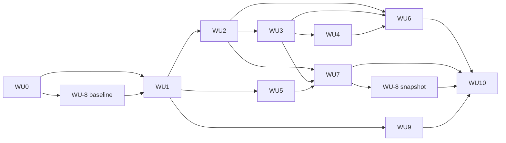

# Confluence Media Gallery Phase 0 仕様書（性能PoC）

| 項目 | 内容 |
|---|---|
| 層 | L3（フェーズ仕様） |
| 上位文書 | `docs/Confluence_Media_Gallery_V1_Implementation_Spec.md`（以下「V1仕様書」）、`docs/Confluence_Media_Gallery_Development_Test_Guide.md`（以下「ガイド」） |
| 対象 | V1仕様書Section 14のP0-1〜P0-7、Section 16 Phase 0 |
| 実装 | Claude Code |
| 裁定・承認 | ユーザー |

## 0. 位置づけ

Phase 0はV1本実装の前提ゲートである。V1仕様書が前提とする配信経路、プラットフォーム挙動、課金状態が実環境で成立することを実Attachmentと実siteで証明し、成立する経路だけを本実装へ引き継ぐ。

- 成果物はprobeコード、計測証跡、判定記録、Phase 0報告書である。
- Phase 1へ引き継ぐコードは `src/shared/api`（adapter interface）、`src/shared/types`、縮退state machine、課金防止ハーネス、テスト基盤である。probe UIはPhase 0で役目を終える。
- 本文書はV1仕様書の決定を継承する。実測により仕様変更が必要になった場合は上申事項（Section 10）として記録し、ユーザー承認後にV1仕様書を改訂する。
- V1仕様書Section 0.1、4.7およびガイドSection 14の恒久方針は、probeコードにも同じ基準で適用する。

## 1. 前提

### 1.1 ユーザーが完了させておくもの

| 項目 | 確認方法 |
|---|---|
| Atlassian cloud developer site（development install先） | site URLを提示 |
| 個人Confluence Free site（production相当。Phase 5で使用） | 作成済み |
| Node.js 24 LTS、Forge CLI現行版、`forge login` 完了 | `forge whoami` |
| 本アプリ専用Developer Space、請求アカウント設定・請求同意済み、支払方法未登録 | Developer Console |
| Atlassianアカウント2段階認証 | — |
| GitHubリポジトリ（public） | URLを提示 |
| ガイドSection 6.2のテストspace・ページ作成とAttachment upload | space URLを提示 |
| Chrome現行安定版、Edge現行安定版 | — |

App登録（`forge register`）はWU-0完了後、ユーザー承認のもとで1回行う（ガイドSection 12.2）。

### 1.2 テストデータ

Phase 0で使用するページは次のとおり。

| ページ | 用途 |
|---|---|
| `MG-00-Smoke` | 全WUの日常確認 |
| `MG-02-High-Resolution` | WU-3（8K decode） |
| `MG-03-Video-Audio` | WU-4（Range／seek） |
| `MG-05-Perf-50` | WU-7（標準セッション）、WU-9（標準Viewer比較） |
| `MG-08-Versioning` | WU-2、WU-3（version invalidation） |
| `MG-09-Permissions` | WU-6（権限別表示） |

`MG-06`、`MG-07`はPhase 3で使用する。

各ページのAttachmentについて、file hash、解像度、MIME、fileSize、`attachmentId`、`version` を `docs/evidence/phase0/test-manifest.json` に記録する。file本体はローカルとConfluence siteにのみ置く。

## 2. Phase 0の範囲

Phase 0で扱うのはSection 3のWU-0〜WU-10に列挙した作業に限る。Gallery本実装、Viewer本実装、UI仕上げ、Firefox／Safari／モバイル検証、200／500件試験、staging deploy、Marketplace掲載準備、E2EのCI化はそれぞれPhase 1以降の該当フェーズで扱う。

## 3. 作業単位（WU）と依存関係

### 3.1 WU一覧

| WU | 内容 | 対応P0 | 主担当 |
|---|---|---|---|
| WU-0 | project scaffold、課金防止ハーネス、負例fixture、静的ゲート | P0-7（静的） | Claude Code |
| WU-1 | probe app骨格：manifest、2 resource、計測基盤、adapter interface | — | Claude Code |
| WU-2 | Thumbnail直接表示 | P0-1 | Claude Code + ユーザー |
| WU-3 | Original画像直接表示 | P0-2 | Claude Code + ユーザー |
| WU-4 | 動画・音声Range／seek | P0-3 | Claude Code + ユーザー |
| WU-5 | Fullscreen Modal | P0-4 | Claude Code + ユーザー |
| WU-6 | CSP／egress／Runs on Atlassian適格性 | P0-5 | Claude Code + ユーザー |
| WU-7 | APIポイント／応答速度／縮退mock | P0-6 | Claude Code + ユーザー |
| WU-8 | 実Usage監視、baseline、cost-surface register | P0-7（実環境） | ユーザー + Claude Code |
| WU-9 | Confluence標準Viewer比較baseline | — | ユーザー + Claude Code |
| WU-10 | Phase 0報告書、除外経路、V1仕様書改訂案 | — | Claude Code |

### 3.2 依存グラフ



- 並列：WU-2／WU-5／WU-9はWU-1完了後に並列で進める。
- 直列：WU-3はWU-2の後、WU-4はWU-3の後、WU-6はWU-2〜4の後。
- WU-8は2段階。baselineはWU-1の初回deploy前、snapshotはWU-7完了後の次回日次更新後。
- `forge deploy` と `forge install --upgrade` は直列化し、manifestの変更は1WUずつ行う。

### 3.3 停止条件

次のいずれかで後続WUを止め、ユーザーへ上申する。

- WU-0の静的ゲートが `GREEN` 以外
- WU-8 baselineでUsage正値、費用正値、支払方法登録のいずれかを検出
- WU-3が不合格
- WU-6でegress宣言なしにロードできないメディア種別を検出
- 恒久方針の範囲内で解決策が見つからないWU

## 4. WU詳細

各WUは「入力」「作業」「合格条件」「提出物」「上申条件」で定義する。合格条件はV1仕様書Section 14を正とし、本文書は計測方法と証跡形式を定める。

### WU-0 scaffold・課金防止ハーネス

**入力**：V1仕様書Section 4.7、ガイドSection 3〜4、13

**作業**

1. リポジトリをread-only監査し、既存ファイルの有無を記録する。
2. ガイドSection 4の構成でscaffoldを作成する。Vite multi-page（`gallery`、`viewer`）、TypeScript strict、Vitest、jsdom、Playwright、ESLint、Prettier。
3. `config/forge-cost-policy.json` を正の許可リストで作成する。初期許可はV1仕様書Section 4.7.2およびガイドSection 4.1の表のとおり。
4. `scripts/verify-forge-cost-policy.mjs` を作成する。検査順序はガイドSection 4.1の1〜7。manifest／packageは構造解析、sourceはTypeScript AST、buildは文字列走査。
5. `tests/cost-guard/negative-fixtures/` に、V1仕様書Section 4.7.2の検出カテゴリごとに1fixtureを作成する。カテゴリ：function、resolver、trigger、scheduledTrigger、consumer、webtrigger、queue、storage、sql、objectStore、container、llm、rovo、remotes、externalAuth、licensing、wildcardHost、nonAtlassianOrigin、runtimeDependency、fetch、xhr、websocket、eventSource、sendBeacon、invoke、consoleError、consoleLog、copyleftLicense、unknownLicense、ciPaidRunner、ciArtifactUpload、confirmScopes、globalHandlerCallsConsoleError。
6. `.github/workflows/ci.yml` をGitHub Actions無料枠で作成する。ガイドSection 13の恒久CI検査を全て必須checkにする。
7. `docs/operations/cost-surface-register.md` の雛形を作成する。値はユーザーが記入する。
8. `CODEOWNERS` に保護対象ファイルを列挙する。
9. `npm run verify:local` を通し、`test-results/cost-guard/<sha>.json` を生成する。

**合格条件**

- `verify:cost` が正常系で0終了し、全負例fixtureが期待rule IDで非0終了する。
- reportにcommit SHA、policy version、manifest hash、lockfile hash、全rule結果がある。
- CIが全checkを必須として動作する。

**提出物**

- scaffold一式（commit）
- `test-results/cost-guard/<sha>.json`
- `docs/evidence/phase0/WU-0_cost-guard-rules.md`：負例fixtureと対応rule IDの表

**上申条件**

- GitHub Actions無料枠で必須checkが成立しない
- TypeScript ASTで検出困難なパターンが見つかった

### WU-1 probe app骨格

**入力**：V1仕様書Section 4.1、4.2、4.6、ガイドSection 12

**作業**

1. `manifest.yml`：Confluence `macro` module（block layout）、`gallery` と `viewer` の2 resource、scopeは `read:attachment:confluence`。`read:user:confluence` はWU-6で追加する。
2. `src/shared/api/` にadapter interfaceを定義する。`ConfluenceApi` interface、`requestConfluence()` を包む実装、jsdom用mock実装の3つ。`@forge/bridge` のimportはこのディレクトリに閉じる。
3. 計測基盤 `src/shared/probe/`：
   - `mark(name)` / `measure(name, start, end)`：`performance.mark`／`measure` のwrapper。mark名はSection 5.1に従う。
   - request inventory：`PerformanceObserver`（`resource` entry）で取得できる範囲を記録する。cross-originのredirect詳細はDevTools HARを正本とする。
   - 計測結果を画面上のtextareaへJSON出力する。
4. probe UI：Attachment一覧を取得し、`attachmentId`、`version`、`mediaType` を表形式で表示する最小画面。各行に「Thumbnail」「Original」「Modal」のprobeボタンを置く。
5. ユーザー承認後に `forge register --developer-space-id <id>` を1回実行し、App IDをmanifestへ反映する。
6. `forge deploy -e development`、`forge install --site <dev-site> --product confluence -e development` を実行する。install時のscope確認はユーザーが行う。

**合格条件**

- deploy済みdevelopment環境で、macroをページに置くとAttachment一覧が表示される。
- `verify`（`forge lint` 含む）が通る。
- Forge CLIの適格性確認でRuns on Atlassian適格と表示される。

**提出物**

- manifest、probe app（commit）
- 初回deploy／installのログ（sanitize済み）
- `forge lint` 結果

**上申条件**

- `forge register` の登録経路が本文書と異なる
- 最小scopeで一覧取得が401／403になる

### WU-2 Thumbnail直接表示（P0-1）

**入力**：V1仕様書Section 4.4、5.2、6.3、Section 14 P0-1

**作業**

1. `GET /wiki/api/v2/attachments/{id}/thumbnail/download?version=&width=&height=` を `requestConfluence()` で呼び、302レスポンスの `Location`、`Cache-Control`、`Expires`、`ETag` を記録する。redirect: manualの可否を先に確認する。
2. 同じURLをnative `` でロードし、表示可否、`naturalWidth`／`naturalHeight`、`decode()` 完了時間を記録する。
3. 同一URLを2回目に設定し、DevTools Networkでcache状態（disk／memory／304／200）を記録する。302自体のcacheとredirect先のcacheを分けて記録する。
4. `width`／`height` を320、640で変えて実寸を確認する。
5. `MG-08-Versioning` でAttachmentを更新し、`version` 指定あり・なしそれぞれで新版が返ることを確認する。
6. redirect先hostを全て記録する（WU-6の入力）。
7. Chrome／Edge両方で2〜3を実施する。

**計測**

| 項目 | 方法 |
|---|---|
| 302レスポンスヘッダー | `requestConfluence()` のresponse、またはDevTools |
| native `` 表示可否 | `load`／`error` event |
| decode時間 | `mark` → `decode()` resolve |
| 2回目のcache状態 | DevTools Network Size列、Cold／Warm各3回 |
| redirect先host | DevTools |

**合格条件**（V1仕様書P0-1）

ThumbnailまたはPreviewをnative image requestで表示できること。

**提出物**

- `docs/evidence/phase0/P0-1/result.md`：表示可否、cache状態、host一覧、version検証結果
- sanitize済みrequest table
- Chrome／Edgeそれぞれのscreenshot

**上申条件**

- native `` で表示できない場合、Thumbnailに限りBlob fallbackを採用する。採用の可否を上申する。
- 302がブラウザにcacheされない場合、APIポイント消費構造への影響をWU-7の入力として記録し、報告書で明示する。

### WU-3 Original画像直接表示（P0-2）

**入力**：V1仕様書Section 4.4、7.4、7.5、Section 14 P0-2

**作業**

1. v1 download endpoint `GET /wiki/rest/api/content/{pageId}/child/attachment/{attachmentId}/download?version=` の302を記録する。
2. 一覧レスポンスの `downloadLink`／`_links.download` を同条件で試し、認証状況ごとの結果を記録する。
3. 成立した方を正本候補とし、native `` で4K、8K PNG／JPEGを表示する。progressive転送中の描画、decode完了時間、メモリ（DevTools Memory）を記録する。
4. 同一URLの2回目表示でネットワーク再転送が抑制されることを確認する（Cold／Warm各3回）。
5. `MG-08-Versioning` でversion更新後、新版が表示されることを確認する。
6. Gallery側で `<link rel=preload>` または非表示 `` で先読みした後、Modal iframe内の `` で同一URLを表示し、HTTP cache再利用を確認する（WU-5完了後）。
7. redirect先hostを記録する。
8. `crossorigin` 付き `` ロードと `canvas.toBlob()` の成立性を確認する（G1。V1仕様書P0-8の前半。proposals/2026-09-18_writer-thumbnail-cache.md）。

**合格条件**（V1仕様書P0-2）

Originalをnative image requestで表示でき、2回目の同一URL表示でネットワーク再転送が抑制されること。

**提出物**

- `docs/evidence/phase0/P0-2/result.md`：正本endpoint、`downloadLink` の結果、8K decode時間、cache状態、version検証、iframe間cache再利用
- sanitize済みrequest table
- screenshot

**上申条件**

- 両endpointともnative `` で表示できない場合、Original機能をブロックし、恒久方針の範囲内で成立する別方式の有無とPhase 1着手可否をユーザーへ報告する。
- `downloadLink` が使えずv1 endpointだけが成立する場合、V1仕様書Section 5.1の `downloadLink` 定義の改訂案を報告書に含める。

### WU-4 動画・音声Range／seek（P0-3）

**入力**：V1仕様書Section 7.6、7.7、Section 14 P0-3

**作業**

1. WU-3で確定したdownload endpointを `<video src>`（`preload=metadata`、native controls）に設定する。
2. `loadedmetadata` 到達時のtransferred bytesを記録する。
3. 再生開始、任意位置seek、連続seek時のrequestを記録する。`Range` header、206 Partial Content、`Content-Range` の有無を確認する。
4. 大容量MP4（`MG-03`）で、全量download完了前に再生開始とseekができることを確認する。
5. `<audio>` でMP3、WAV、M4Aを同様に確認する。
6. Viewer close相当の処理（pause、`src` 解除、`load()`）後にDevTools Memoryでbufferが解放されることを確認する。
7. WebM、Oggの再生可否をChrome／Edgeで記録する。

**合格条件**（V1仕様書P0-3）

大容量MP4で全量download完了前に再生開始とseekが可能であること。

**提出物**

- `docs/evidence/phase0/P0-3/result.md`：206の有無、seek時request、metadata bytes、buffer解放
- sanitize済みrequest table

**上申条件**

- Rangeが成立しない場合、動画／音声をDownload-onlyとするかリリース延期かの裁定を仰ぐ。画像の判定とは分離する。

### WU-5 Fullscreen Modal（P0-4）

**入力**：V1仕様書Section 4.1、4.2、7.1、7.2、7.3、13.4、Section 14 P0-4

**作業**

1. probe Galleryから `Modal` を `size: fullscreen`、`title`／`icon` 未指定、`closeOnEscape: false` で開き、Viewer resourceを表示する。
2. Forge側ヘッダーの有無、実表示領域（`innerWidth`／`innerHeight`）を記録する。
3. `Esc` を自前handlerで捕捉し `view.close()` で閉じられることを確認する。native `<video controls>` にfocusがある状態でのEscも確認する。
4. click → `Modal.open()` → Viewer document `DOMContentLoaded` → 最初の描画をmarkで計測する。cold／warm各5回。
5. Viewer resourceのidle warm-up：Gallery表示後に `<link rel=prefetch>` または非表示iframeでViewer bundleを温め、cold起動時間の変化を比較する。
6. Gallery iframe → Modal iframe → Gallery iframeのBridge `events` 往復を確認し、往復時間を記録する。
7. Modal open時のfocus移動、close時の起動元への復帰を確認する。
8. Galleryロード中にclickし、Modal openとGallery初期ロードが独立に進むことを確認する。

**合格条件**（V1仕様書P0-4）

画像取得完了と独立にModalを開け、Viewer UIとGallery初期ロードが独立に進むこと。

**提出物**

- `docs/evidence/phase0/P0-4/result.md`：ヘッダー有無、表示領域、Esc動作、起動時間（cold／warm中央値・P95）、warm-up効果、events往復、focus
- Performance trace（sanitize済み）

**上申条件**

- Forge側ヘッダーが表示される場合、V1仕様書Section 7.2の閉じるボタン方針をForgeヘッダー正で確定する改訂案を報告書に含める。
- Bridge `events` が到達しない場合、Galleryキャッシュ同期（Section 4.2）を除外する改訂案を含める。
- `closeOnEscape: false` でもForge側がEscを処理する場合。

### WU-6 CSP／egress／Runs on Atlassian適格性（P0-5）

**入力**：V1仕様書Section 4.6、12、Section 14 P0-5、WU-2〜4のredirect先host一覧

**作業**

1. WU-2〜4のredirect先hostを一覧化し、Atlassian内部通信として扱われるhostであることを確認する。
2. `permissions.external` 未宣言の状態で、Thumbnail／Preview／Original／動画／音声の全種別がロードできることをdeploy済みdevelopmentで再確認する。consoleのCSP violation有無を記録する。
3. `forge lint` を実行する。
4. Forge CLIの適格性確認でRuns on Atlassian適格であることを記録する。
5. `read:attachment:confluence` だけで一覧、thumbnail、download endpointが通ることを実呼び出しで確認する。
6. `read:user:confluence` を追加したmanifestでdeploy／install upgradeを行い、scope差分表示をユーザーが確認する手順を記録する。users-bulkが通ることを確認する。
7. `MG-09-Permissions` で、閲覧制限ページ・制限付きAttachmentが権限のあるユーザーにだけ表示されることを、developer siteの第2ユーザーで確認する。
8. redirect先hostのallowlist検証ロジック（`src/shared/api`）の初期値を確定する。
9. manifest scopeへ `write:attachment:confluence` を `read:user:confluence` と同時に追加し、upgrade時のscope差分をユーザーが確認する。upload・版更新・削除のroundtrip probe（G2。V1仕様書P0-8の後半）を実施する（proposals/2026-09-18_writer-thumbnail-cache.md）。

**合格条件**（V1仕様書P0-5）

egress宣言ゼロ・最小scopeで動作し、Runs on Atlassian適格であること。

**提出物**

- `docs/evidence/phase0/P0-5/result.md`：host一覧、CSP violation有無、lint結果、適格性結果、scope別動作、権限別表示
- allowlist初期値（`config/forge-cost-policy.json` へ反映）

**上申条件**

- egress宣言なしにロードできないメディア種別がある場合、種別除外か最小host追加かの裁定を仰ぐ。
- 最小host追加がRuns on Atlassian適格性に影響する場合。

### WU-7 APIポイント／応答速度／縮退mock（P0-6）

**入力**：V1仕様書Section 4.5、9、11.1、Section 14 P0-6、WU-2／3の302 cache結果

**作業**

1. **標準セッション**：`MG-05-Perf-50` で一覧取得 → 30件を順にThumbnail→Preview→Original表示 → 各件の詳細＋更新者取得、をprobeで再現する。全REST requestのendpoint、返却object数、レスポンスヘッダー（`RateLimit-*`、`X-RateLimit-*`、`Retry-After`）を記録する。
2. 公式コスト式（基本1＋オブジェクト加点：コア1、ユーザー・権限2）で1セッションの推定ポイントを算出し、V1仕様書Section 4.5.4の基準値との差分を出す。
3. Thumbnailの302とredirect後バイナリ取得を分けたrequest inventoryを作る。WU-2の結果に基づき、2回目セッションのポイントを別途算出する。
4. **page size比較**：一覧の `limit` を25、50、100、250で変え、最初のタイル表示時間、全件取得完了時間、request数を各3回計測する。
5. **重複送信確認**：Viewer open／close、前後移動、Panel再表示相当の操作で、一覧・詳細・users-bulkが1回ずつ送信されることをadapterで検証する（in-flight dedupe、セッションキャッシュをadapter層に実装）。
6. **節約策の有効／無効比較**：計測build限定のフラグで、一覧レスポンス再利用・in-flight dedupe・users-bulk集約を切り替え、click → Modal、click → Current Preview、前後移動 → 次メディアの中央値・P95を比較する。フラグはTypeScript定数とし、production buildで除去されることを `verify:cost` で確認する。
7. **縮退mock**：jsdom＋mock adapterで、`r` ヘッダー出現→`Degraded`、429→`Blocked`、`Retry-After` 経過→`Normal` の遷移、probe発行の閾値・間隔、cold start時の429表示を検証する。
8. Per-Tenant Pool（Tier 2）の適用条件、申請経路（Partner Portal）、費用の有無を公式資料で確認し記録する。
9. Global Pool 65,000ポイント／時が飽和する同時テナント数の目安を実測値から算出する。

**合格条件**（V1仕様書P0-6）

- 標準セッションの実測が320ポイント以内、または差異を説明して基準値を改訂できること。
- 節約策の有効／無効で応答時間の中央値・P95が同等であること（テストノイズ範囲内）。
- click、`pointerenter`、前後移動handlerに含まれる処理が同期処理とrequest発行のみであること（AST検査）。
- 縮退3段階の遷移がmock adapterで検証されていること。

**提出物**

- `docs/evidence/phase0/P0-6/result.md`：request inventory、推定ポイント（初回／2回目）、page size比較、重複送信確認、節約策比較、飽和テナント数目安、Tier 2条件
- `docs/evidence/phase0/P0-6/rate-limit-headers.md`：観測した全ヘッダーのサンプル（sanitize済み）
- `tests/unit/rate-limit-state.test.ts`（Phase 1へ引き継ぎ）

**上申条件**

- 実測ポイントが320を超える場合、基準値改訂案と支配項の内訳を提示し、V1仕様書Section 4.5.4の改訂を上申する。
- 302がcacheされず2回目セッションも初回と同等のポイントを消費する場合、飽和テナント数への影響を明示し、対策の要否を上申する。提示する対策はV1仕様書Section 4.5.1の範囲に限る。

### WU-8 実Usage監視・baseline・cost-surface register（P0-7実環境）

**入力**：V1仕様書Section 4.7.1、4.7.3、4.7.4、ガイドSection 8.5、8.6

**作業**

**8a baseline（WU-1の初回deploy前）**

1. ユーザーがDeveloper Console `Usage and costs` で、全課金対象メトリクスが0または正常な「利用実績なし」表示、算定費用USD 0.00であることを確認し、screenshotを `local/` に保存する。
2. ユーザーがBilling Consoleで支払方法未登録を確認する。
3. ユーザーが各請求面（developer site、Free site、Developer Space、GitHub、外部サービス、Marketplace、ホスティング）の状態を `cost-surface-register.md` に記入する。
4. Claude Codeがsanitize済みsnapshot（取得UTC、対象期間、App ID、environment、commit SHA、値・unit、費用、支払方法有無、確認者、policy version）を `docs/operations/usage-snapshots/<date>-baseline.json` に記録する。

**8b snapshot（WU-7完了後）**

1. WU-2〜7の実site操作完了後、次回12:00 UTC更新を待つ。
2. ユーザーが全環境（development）のUsageを確認し、全メトリクス0、USD 0.00を確認する。Logs writesが正値なら `RED` として発生源を特定する。
3. Claude Codeがsnapshotを記録し、baselineとの差分を出す。
4. cost-surface registerの日付を更新する。
5. cost-guard reportのcommit SHAとsnapshotのcommit SHAを照合する。

**合格条件**（V1仕様書P0-7）

- baselineとsnapshotの両方で全メトリクス0、USD 0.00、支払方法未登録。
- 状態が `GREEN`。`UNKNOWN` は再判定待ちとする。

**提出物**

- `docs/operations/usage-snapshots/<date>-baseline.json`、`<date>-phase0.json`
- 更新済み `cost-surface-register.md`
- `docs/evidence/phase0/P0-7/result.md`：判定状態の記録

**上申条件**

- baselineで正値または支払方法登録を検出（即時停止）
- snapshotでLogs writes等の正値を検出し、発生源をアプリ起因と特定できない
- 支払方法登録が必須と表示された

### WU-9 Confluence標準Viewer比較baseline

**入力**：V1仕様書Section 15.4、ガイドSection 8.1〜8.3

**作業**

1. `MG-05-Perf-50` の代表画像（1080p、4K、8K各1件）について、Confluence標準の画像プレビューで次を計測する：click → プレビュー表示、click → 高解像度画像表示、次画像へ移動 → 表示。Cold／Warm各5回。
2. 同じ画像をprobe Viewer（WU-5＋WU-3の組み合わせ）で計測する。
3. transferred bytes、request count、long taskを両者で記録する。
4. 同じ端末、ユーザー、ブラウザ、ネットワークprofile（100 Mbps／RTT 50 ms相当のDevTools throttling）で実施する。
5. 体感評価はユーザーが記入する。

**合格条件**

baselineとして数値が揃っていること。合否判定はPhase 5で行う。

**提出物**

- `docs/evidence/phase0/baseline/standard-viewer.md`：計測条件、中央値・P95表、体感メモ

**上申条件**

- probe Viewerが標準Viewerより遅い項目がある場合、原因の切り分け（プラットフォーム固有／アプリ固有）を報告書に含める。

### WU-10 Phase 0報告書・除外・改訂案

**入力**：WU-2〜9の全提出物

**作業**

1. `docs/evidence/phase0/Phase0_Report.md` を作成する。構成：P0ごとの合否、根拠証跡へのパス、除外経路、上申事項一覧、V1仕様書・ガイドの改訂案（`docs/proposals/` へdiff形式）、Phase 1着手の推奨可否。
2. 除外経路をV1仕様書から外す改訂案を作る。
3. V1仕様書Section 18の定数のうちPhase 0で実測した値（Thumbnail最大幅、Preview bucket、probe閾値等）の改訂案を含める。
4. Phase 1へ引き継ぐコードとPhase 0で役目を終えるコードを明示する。

**合格条件**

- V1仕様書Section 17のうちPhase 0に該当する項目（P0-1、P0-2、P0-4、P0-5、P0-6、P0-7の合格、出荷する場合はP0-3）の判定が記録されている。
- 全上申事項にユーザーの裁定が記録されている。

**提出物**

- `docs/evidence/phase0/Phase0_Report.md`
- `docs/proposals/<date>_phase0-revisions.md`

## 5. probe実装規約

### 5.1 計測mark名

`performance.mark` の名前は `p0.<wu>.<event>` とする。

| mark | 位置 |
|---|---|
| `p0.click` | tile／button click handler先頭 |
| `p0.modal.open-called` | `Modal.open()` 呼び出し直後 |
| `p0.viewer.dcl` | Viewer document `DOMContentLoaded` |
| `p0.viewer.first-paint` | 最初の描画後のrAF |
| `p0.img.src-set` | `` 設定直後 |
| `p0.img.load` | `load` event |
| `p0.img.decoded` | `decode()` resolve |
| `p0.nav.next` | 前後移動handler先頭 |
| `p0.nav.shown` | 次メディア表示後のrAF |
| `p0.api.<name>.start` / `.end` | 各REST呼び出し |

measureは `p0.<from>→<to>` の形式で命名し、JSON出力に含める。

### 5.2 request inventory

- `PerformanceObserver` の `resource` entryを収集し、`name`（hostとpathのみ。queryは除去）、`initiatorType`、`transferSize`、`encodedBodySize`、`duration` を記録する。
- cross-originで `Timing-Allow-Origin` がない場合、DevTools HARを正本とし、JSON出力に `partial: true` を付ける。
- HAR原本は `local/` に置く。Claude Codeがsanitize scriptでhost、path、status、size、timing、cache状態を抽出したtableを `docs/evidence/` へ生成する。

### 5.3 adapter interface

```typescript
interface ConfluenceApi {
  listAttachments(pageId: string, cursor?: string, limit?: number): Promise<AttachmentPage>;
  getAttachment(attachmentId: string, opts?: { includeLabels?: boolean }): Promise<AttachmentDetail>;
  resolveUsers(accountIds: string[]): Promise<UserSummary[]>;
  thumbnailUrl(attachmentId: string, version: number, width: number): string;
  originalUrl(pageId: string, attachmentId: string, version: number): string;
}
```

- URL生成関数はnative elementの `src` に渡すURLを返す。
- 実装の通信手段は `requestConfluence()` とする。
- レスポンスの `RateLimit-*`、`X-RateLimit-*`、`Retry-After` をadapterが解釈し、縮退state machineへ通知する。
- mock実装は同じinterfaceを実装し、任意のstatus／ヘッダー／遅延を注入できる。

### 5.4 縮退state machine

- `src/shared/api/rate-limit-state.ts` に `Normal`／`Degraded`／`Blocked` の遷移を実装する。V1仕様書Section 11.1の条件をそのまま実装し、UIから独立させる。
- Phase 0では遷移ロジックと単体テストを作る。UI表示（11.1.3）はPhase 2で実装する。

### 5.5 probeコードの制約

- 計測結果の出力先は画面上のtextareaと診断バッファとする。
- probeの通信経路は `requestConfluence()` とnative media requestの2つとする。
- 節約策比較フラグはTypeScript定数とし、production buildで定数畳み込みにより除去されることを `verify:cost` のbuild走査で確認する。
- 実tenantへの負荷はガイドSection 6.3の標準セッション相当に留める。

## 6. 環境と計測条件

### 6.1 使用環境

| 用途 | 環境 |
|---|---|
| 実装探索、素早い反復 | development + `forge tunnel`（Chrome） |
| P0合格証跡 | deploy済みdevelopment（Chrome／Edge） |
| staging | Phase 5で使用 |
| production | Phase 5で使用 |

証跡はdeploy済みdevelopmentで取得する。tunnelでの計測値は開発参考値とする。CSP／cache／timingで環境差が疑われた項目はstagingで再取得する。

### 6.2 計測条件（ガイドSection 8.1〜8.2）

- 同じ端末、ユーザー、ページ、Attachment。
- ブラウザversion、画面解像度、DPRを各resultに記録する。
- Cold：DevTools「Disable cache」ONでsite cacheを消してから1回。
- Warm：Cold完了後、Disable cache OFFで同じ操作。
- ネットワークprofile：DevTools throttlingで100 Mbps／RTT 50 ms相当を既定とし、20 Mbps／RTT 100 msを追加条件とする。
- 各計測は5回以上。中央値とP95を記録する。

### 6.3 認証

ガイドSection 7.1のとおり、実site操作はユーザーのsigned-in browserで行う。Playwright E2Eはユーザーが希望する場合に、headed loginで `storageState` を `local/` に保存し、Claude Codeが非破壊probeを自動実行する。

## 7. 証跡

### 7.1 ディレクトリ

```
docs/evidence/phase0/
├─ test-manifest.json
├─ Phase0_Report.md
├─ WU-0_cost-guard-rules.md
├─ P0-1/ … P0-7/
│  ├─ result.md
│  ├─ requests-<browser>-<cold|warm>.md
│  └─ screenshots/
└─ baseline/
   └─ standard-viewer.md
docs/operations/
├─ cost-surface-register.md
└─ usage-snapshots/
docs/proposals/
local/                      # HAR／trace原本、未sanitize screenshot、Usage画面screenshot
```

### 7.2 result.mdの必須項目

- 計測日、commit SHA、環境、ブラウザ／version、DPR、ネットワークprofile
- 確認事項ごとの結果（V1仕様書Section 14の確認事項と1対1）
- 合否と根拠
- 上申事項
- 未実施項目と理由

### 7.3 配置先

`docs/evidence/` にはsanitize済みの成果物を置く。HAR原本、Performance trace原本、signed URLを含むscreenshot、`storageState`、token、Usage画面のscreenshot原本は `local/` に置く（ガイドSection 10）。

## 8. Phase 0のDefinition of Done

- WU-0〜WU-10の提出物が全て揃っている。
- P0-1、P0-2、P0-4、P0-5、P0-6、P0-7の判定が記録されている。P0-3は動画・音声を出荷する場合に必須。
- 課金防止ハーネスの状態が `GREEN` で、baselineとPhase 0後snapshotの両方が記録されている。
- Phase 0報告書に除外経路、上申事項と裁定、V1仕様書改訂案が含まれている。
- Phase 1へ引き継ぐコードがPhase 1のscaffoldへ分離されている。
- ユーザーがPhase 1着手を承認している。

## 9. 責任分界（Phase 0）

| 作業 | ユーザー | Claude Code |
|---|---|---|
| site／space／テストデータ準備 | 主担当 | test-manifest記録 |
| `forge login`、Developer Space、請求同意 | 必須 | — |
| `forge register`（1回） | 承認・実行 | command準備 |
| deploy／install（development） | scope確認 | 実行 |
| probe実装、計測基盤、テスト | レビュー | 主担当 |
| ブラウザでの計測操作 | 操作 | 手順書、解析 |
| HAR／trace取得とsanitize | 取得 | sanitize script、table生成 |
| Usage／Billing Console確認 | 必須 | snapshot記録 |
| cost-surface register記入 | 必須 | 雛形、更新補助 |
| 標準Viewer体感評価 | 必須 | 数値計測 |
| 上申事項の裁定 | 必須 | 起案 |
| Phase 0報告書 | 承認 | 作成 |
| V1仕様書・ガイド改訂 | 承認 | 改訂案（`docs/proposals/`） |

## 10. 上申候補

| ID | 事項 | 発生WU | 裁定の選択肢 | 停止区分 |
|---|---|---|---|---|
| E-01 | `forge register` の登録経路が本文書と異なる | WU-1 | 手順更新 | 続行 |
| E-02 | Thumbnail 302がブラウザにcacheされない | WU-2 | ポイント基準値改訂／許容 | 続行 |
| E-03 | Original直接表示が不成立 | WU-3 | Original機能ブロック、Phase 1着手可否 | 即時停止 |
| E-04 | `downloadLink` が使えずv1 endpointが正本 | WU-3 | Section 5.1改訂 | 続行 |
| E-05 | Rangeが不成立 | WU-4 | Download-only／延期 | 続行 |
| E-06 | Forge Modalヘッダー表示あり | WU-5 | Section 7.2改訂 | 続行 |
| E-07 | Bridge events不到達 | WU-5 | Section 4.2のキャッシュ同期除外 | 続行 |
| E-08 | egress宣言なしにロードできない種別 | WU-6 | 種別除外／最小host追加 | 即時停止 |
| E-09 | 実測ポイントが320超 | WU-7 | Section 4.5.4改訂 | 続行 |
| E-10 | baseline／snapshotで正値 | WU-8 | 原因特定 | 即時停止 |
| E-11 | 支払方法登録の必須化 | WU-8 | Section 0.1再審査 | 即時停止 |
| E-12 | GitHub Actions無料枠で必須check不成立 | WU-0 | CI無効化、`verify:local` 必須化 | 続行 |

「続行」はWUを進めつつ報告書へ積む。「即時停止」はユーザーの応答を待つ。E-03はWU-4以降の画像依存WUを止め、WU-5、WU-8、WU-9は続行する。

## 11. Phase 0固定パラメータ

| パラメータ | 値 |
|---|---|
| 計測回数 | 各条件5回以上 |
| 標準セッション件数 | 一覧50件中30件表示 |
| page size比較 | 25／50／100／250 |
| Thumbnail width候補 | 320／640 |
| Original検証解像度 | 1080p／4K／8K |
| ネットワークprofile | 100 Mbps／RTT 50 ms（既定）、20 Mbps／RTT 100 ms |
| Usage snapshot取得 | 実site操作完了後の次回12:00 UTC更新後 |
| 証跡有効期限 | Phase 1着手時点で48時間以内のsnapshot |
